<div align="center">


### Comprehensive automated near- and far-field SAR assessments using Sim4Life

[](https://github.com/rwydaegh/goliat/actions/workflows/test.yml)
[](https://github.com/rwydaegh/goliat/actions/workflows/docs.yml)
[-brightgreen.svg?logo=pytest)](.github/workflows/test.yml)
[](https://qlty.sh/gh/rwydaegh/projects/goliat)
[](https://ghloc.vercel.app/rwydaegh/goliat?branch=master)
[](https://github.com/astral-sh/ruff)
[](https://www.python.org/)
[](https://www.qt.io/qt-for-python)
[](https://osparc.io/)
[![Sim4Life](https://img.shields.io/badge/Sim4Life-8.2.0-blue.svg?logo=data:image/png;base64,iVBORw0KGgoAAAANSUhEUgAAACAAAAAgCAYAAABzenr0AAADCUlEQVRYhe3XTWhcVRgG4OfOnclMJj9NozHkx7S2UWoUDNR2Y+tPidgsVKQVf5BqUWgRI93UjbhxIe7FjRtBFy0IbkSkiyiIRqFuSlKrKI0lTSjVNpo2tamZOS4mU02dTO7UVBD6woHDPS/v997vfN8593Id1/E/RA57MIxTmMYo3kT3tQ6+FeMIUSoX4vytIdXbH6KWtoCAGexFdC2CD2BOlAn1614LLVvGQ8uW8ZAfDiE/HELura/+buQg4iSiiUhoxedRKtfYfPenMqvvu7xQeKAFRG3dMk/sV/z+sDD5w524iC+WE04lNPAyWvMb3pbKdlUlZt/4WHRDJ+xHZqUM7IzSTTKt2xKR0w89C6uxeSUMZLAhbrg9UXBI3XFPebp2JQy0IU5lOxMbiDrXl6c3roSBx5NTFww0rCpPb1kJAy9F6WZx012JDRSPH6EuBy8q1cK/MiBKr5Lt2JXYQLxpu3jzIKX6aazGTSfQO5MKv/b2dnxWcbE40l7x+djYiAI/YaKaeJIj84M4tnN6vnIRNkWV3yFnwpxwCNuriSfZgkOFAls3/uzbsfllyacVDJk2J8BHCfSXRQoHEB5+LBdmQueiEfQsGrs0lO+D79CwnHgtt9Y3Tc3RxsnfOhY9vHIL1pty3PwUbsPscqLJm5svz58LisXqpJMKMJIkeK0GRkPg8NeXliRcFFwq7f2xpKK1GOiBiROFJQnTLqdnAJuSiC5XAzkMYh/u7eqOHZtY3PdX1sBeZ73jfCkP/Kj0uXYaF5QycxDnqgXcjQ8xiSJCHAvP7M7/owMqdUHQE07pCi9oDD3SoV4UUoSo1BlhQfeRShm4H++jO53m5jVpa9bGHhzM2jPUoK6ucrKWOogq4V2zhpw1KwQ8h/fKqgP4JJuN0q++3mTfK1WP76s2ADOK1plyRvF39JQNHM1mo76jJ9rd1F5LXdZuAA644Gm/wPMp9KFvx5P1NQe/WjwlX26/bSn0w6M7cv9J8DLaSh/k/Wl0wuiRP5ycWLrHl0K2pqPkLyz8D3T8CdbA7Thjal80AAAAAElFTkSuQmCC)](https://sim4life.swiss/)

[🚀 Get Started](https://rwydaegh.github.io/goliat/user_guide/quick_start/) • [📖 View Tutorials](https://rwydaegh.github.io/goliat/tutorials/overview/)

</div>

<div align="center">


*GOLIAT GUI showing real-time progress monitoring*

</div>

---

## What is GOLIAT?

GOLIAT is a Python framework that **automates electromagnetic field (EMF) dosimetry simulations** from start to finish. Calculate Specific Absorption Rate (SAR) in digital human phantoms with minimal manual intervention, whether you're simulating a phone call (near-field) or environmental exposure (far-field).

**Perfect for**: Researchers, compliance engineers, and anyone studying EMF exposure in biological tissues.

### Why GOLIAT?

- ⚡ **Zero manual scene building** – Phantoms, antennas, and materials load automatically
- 🔄 **Reproducible** – Configuration-driven workflow ensures consistent results
- ☁️ **Cloud-ready** – Scale from local testing to 100s of parallel cloud simulations
- 📊 **Analysis built-in** – Get plots and detailed SAR reports
- 🎨 **GUI included** – Monitor progress in real-time with ETA tracking

### Project funding and Acknowledgements

This software is written for subtask **1.5** of [*5G expOsure, causaL effects, and rIsk perception through citizen engAgemenT* (GOLIAT)](https://projectgoliat.eu/) funded by the European Union as part of the [CLUE-H consortium](https://www.emf-health-cluster.eu/) to study health effects of radio-frequency electromagnetic fields. Subtask 1.5 is central to the project to relate incident fields to absorption values inside of humans.

## Key features

<table>
<tr>
<td width="50%">

### 🎯 Near-Field Simulations
Simulate devices near the body (phones, wearables). Automatic antenna placement with customizable positions and orientations.

### 🏗️ Modular Architecture
Plug-and-play components for phantoms, materials, gridding, and sources. Extend easily for custom scenarios.

### 📊 Built-in Analysis
Extract whole-body SAR, localized peaks (10g), and tissue-specific metrics. Auto-generate heatmaps and statistical reports.

</td>
<td width="50%">

### 🌐 Far-Field Simulations
Environmental exposure from plane waves. Supports 6 incident directions and multiple polarizations per frequency.

### 🚀 Dual Execution Modes
- **Local**: iSolve for quick testing and debugging
- **Cloud**: oSPARC for large-scale batch processing

### 🖥️ Real-time Monitoring
Interactive GUI with progress bars, ETA estimation, and live logs. Optional web dashboard for monitoring distributed studies across multiple workers. Optional headless mode for automation.

</td>
</tr>
</table>

## Quick start

**Prerequisites**: [Sim4Life](https://zmt.swiss/) 8.2.0 with a valid license. **Note**: GOLIAT has only been tested on Sim4Life 8.2.0; compatibility with newer versions is untested.

GOLIAT supports two installation methods. Most users should install from PyPI:

```bash
# 1. Create a virtual environment with Sim4Life Python
"C:\Program Files\Sim4Life_8.2.0.16876\Python\python.exe" -m venv venv --system-site-packages
source venv/Scripts/activate  # On Windows Git Bash

# 2. Install GOLIAT
python -m pip install goliat

# 3. Navigate to your project directory and initialize
cd /path/to/your/project
goliat init

# 4. Run your first simulation
goliat study near_field_config
```

The `--system-site-packages` flag allows the venv to access Sim4Life's packages (like `s4l_v1`). This installs the latest released version from PyPI. For unreleased features, use editable installation.

**For developers**: If you need to modify code, run tests, or access repository tools, you should install in editable mode instead. See [installation guide](https://rwydaegh.github.io/goliat/installation/#editable-installation) for details.

> **Note**: The `goliat init` command checks your setup and downloads required data files. If you skip this step, `goliat study` will automatically prompt you to install when first run.

That's it! The GUI will launch, download required phantoms/antennas, and run the simulation. Results appear in `results/` with JSON metrics and plots.

**New to GOLIAT?** Follow the [Quick Start Tutorial](https://rwydaegh.github.io/goliat/user_guide/quick_start/) for a step-by-step walkthrough.

---

## Usage examples

### Example 1: Near-field phone simulation

```bash
# Run a 700 MHz phone-to-cheek simulation
goliat study near_field_config
```

**What happens:**
- Loads "thelonious" (6-year-old) phantom
- Places and rotates PIFA antenna either by the face, belly or cheek
- Runs FDTD solver (5-10 min on GPU)
- Extracts head SAR, brain peak SAR (psSAR10g), power balance
- Generates heatmaps in `results/near_field/thelonious/700MHz/by_cheek/`

### Example 2: Far-field environmental exposure

```bash
# Plane wave exposure from 6 directions at 900 MHz
goliat study far_field_config
```

**What happens:**
- Simulates waves from x/y/z axes (± directions)
- Also theta and phi polarizations (so 12 sims total)
- Calculates whole-body average SAR
- Outputs statistical summaries and boxplots

### Example 3: Cloud batch processing

```json
"execution_control": {
  "batch_run": true
}
```

```bash
# Submit 100+ sims to cloud in parallel
goliat study large_study
```

Also want to run setup and extract phases in parallel? See the [Cloud Setup Guide](https://rwydaegh.github.io/goliat/cloud/cloud_setup/) for deploying GPU instances. For monitoring distributed studies across multiple workers, see the [monitoring dashboard documentation](https://rwydaegh.github.io/goliat/cloud/monitoring/) or the [goliat-monitoring repository](https://github.com/rwydaegh/goliat-monitoring).

---

## Screenshots

<details>
<summary> <b>Click to see GOLIAT in action</b></summary>

### Interactive GUI
Real-time progress tracking with phase-based ETA estimation.


### Analysis results
Auto-generated SAR heatmaps by tissue and frequency.


</details>

---

## How it works

GOLIAT follows a simple **5-stage pipeline**:

```mermaid
graph LR
    A[📝 Config] --> B[🎬 Setup]
    B --> C[⚡ Simulate]
    C --> D[📊 Extract]
    D --> E[📈 Analyze]

    style A fill:#4CAF50
    style E fill:#4CAF50
    style B fill:#2196F3
    style C fill:#FF9800
    style D fill:#9C27B0
```



1. **Config**: Load JSON with study parameters (phantoms, frequencies, placements)
2. **Setup**: Auto-build Sim4Life scene (load models, assign materials, set grid)
3. **Simulate**: Run FDTD solver (local or cloud)
4. **Extract**: Pull SAR, power balance, point sensors from results
5. **Analyze**: Generate CSVs, plots, statistical summaries

Each stage is modular, swap in custom phantoms, antennas, or analysis strategies.

🔗 [**Detailed Architecture Guide**](https://rwydaegh.github.io/goliat/developer_guide/technical_guide/)

---

## Documentation

| Resource | Description |
|----------|-------------|
| [Quick Start](https://rwydaegh.github.io/goliat/user_guide/quick_start/) | Get running in 5 minutes |
| [User Guide](https://rwydaegh.github.io/goliat/user_guide/user_guide/) | Workflows and concepts explained |
| [Tutorials](https://rwydaegh.github.io/goliat/tutorials/overview/) | Step-by-step examples (basic → advanced) |
| [Configuration](https://rwydaegh.github.io/goliat/developer_guide/configuration/) | All config options with examples |
| [API Reference](https://rwydaegh.github.io/goliat/reference/api_reference/) | Class and function details |
| [Troubleshooting](https://rwydaegh.github.io/goliat/troubleshooting/) | Common issues and solutions |
| [Cloud & Monitoring](https://rwydaegh.github.io/goliat/cloud/monitoring/) | Web dashboard for distributed execution |
| [Developer Guide](https://rwydaegh.github.io/goliat/developer_guide/developer_guide/) | Extend GOLIAT or contribute |

---

## Contributing

Contributions are welcome! We follow a standard fork-and-PR workflow:

1. **Fork** the repo and create a feature branch
2. **Make changes** following our code style (Ruff, type hints)
3. **Add tests** for new features
4. **Submit a PR** with a clear description

See [CONTRIBUTING.md](CONTRIBUTING.md) for detailed guidelines, code style rules, and how to run tests locally.

**Quick links**: [Code of Conduct](CODE_OF_CONDUCT.md) • [Developer Guide](https://rwydaegh.github.io/goliat/developer_guide/developer_guide/)

> **Note**: GOLIAT has just come out of beta and is still in early development. You may still encounter occasional errors. Please report any issues you find.

---

## Citing

If you use this software, please cite it as:

```bibtex
@software{Wydaeghe_GOLIAT,
  title   = {{GOLIAT: A Comprehensive Automated Near- and Far-Field SAR Assessment Toolbox using Sim4Life}},
  author  = {Wydaeghe, Robin},
  url     = {https://github.com/rwydaeghe/goliat},
  license = {Apache-2.0},
  version = {1.2.0}
}
```

For other citation formats, please refer to the "Cite this repository" button on the main page of our GitHub repository.

## License

This project is licensed under the **Apache 2.0 License** – see [LICENSE](LICENSE) for details.

---

## 🔗 Links

- 📚 [**Full Documentation**](https://rwydaegh.github.io/goliat/)
- 🐛 [**Report an Issue**](https://github.com/rwydaegh/goliat/issues)
- 💬 [**Discussions**](https://github.com/rwydaegh/goliat/discussions)
- 📦 [**Releases**](https://github.com/rwydaegh/goliat/releases)

---

<div align="center">

⭐ **Star this repo if you like the GOLIAT code project!**

</div>
