<div align="center">


### Automated near-field and far-field SAR assessments using Sim4Life

[](https://rwydaegh.github.io/goliat/)
[](LICENSE)
[](.github/workflows/test.yml)
[](https://www.python.org/)
[](https://github.com/rwydaegh/goliat/actions/workflows/test.yml)
[](https://github.com/rwydaegh/goliat/actions/workflows/docs.yml) [](https://github.com/psf/black)
[](https://flake8.pycqa.org/en/latest/)
[](https://www.qt.io/qt-for-python)
[](https://osparc.io/)
[![Sim4Life](https://img.shields.io/badge/Sim4Life-8.2.2+-blue.svg?logo=data:image/png;base64,iVBORw0KGgoAAAANSUhEUgAAACAAAAAgCAYAAABzenr0AAADCUlEQVRYhe3XTWhcVRgG4OfOnclMJj9NozHkx7S2UWoUDNR2Y+tPidgsVKQVf5BqUWgRI93UjbhxIe7FjRtBFy0IbkSkiyiIRqFuSlKrKI0lTSjVNpo2tamZOS4mU02dTO7UVBD6woHDPS/v997vfN8593Id1/E/RA57MIxTmMYo3kT3tQ6+FeMIUSoX4vytIdXbH6KWtoCAGexFdC2CD2BOlAn1614LLVvGQ8uW8ZAfDiE/HELura/+buQg4iSiiUhoxedRKtfYfPenMqvvu7xQeKAFRG3dMk/sV/z+sDD5w524iC+WE04lNPAyWvMb3pbKdlUlZt/4WHRDJ+xHZqUM7IzSTTKt2xKR0w89C6uxeSUMZLAhbrg9UXBI3XFPebp2JQy0IU5lOxMbiDrXl6c3roSBx5NTFww0rCpPb1kJAy9F6WZx012JDRSPH6EuBy8q1cK/MiBKr5Lt2JXYQLxpu3jzIKX6aazGTSfQO5MKv/b2dnxWcbE40l7x+djYiAI/YaKaeJIj84M4tnN6vnIRNkWV3yFnwpxwCNuriSfZgkOFAls3/uzbsfllyacVDJk2J8BHCfSXRQoHEB5+LBdmQueiEfQsGrs0lO+D79CwnHgtt9Y3Tc3RxsnfOhY9vHIL1pty3PwUbsPscqLJm5svz58LisXqpJMKMJIkeK0GRkPg8NeXliRcFFwq7f2xpKK1GOiBiROFJQnTLqdnAJuSiC5XAzkMYh/u7eqOHZtY3PdX1sBeZ73jfCkP/Kj0uXYaF5QycxDnqgXcjQ8xiSJCHAvP7M7/owMqdUHQE07pCi9oDD3SoV4UUoSo1BlhQfeRShm4H++jO53m5jVpa9bGHhzM2jPUoK6ucrKWOogq4V2zhpw1KwQ8h/fKqgP4JJuN0q++3mTfK1WP76s2ADOK1plyRvF39JQNHM1mo76jJ9rd1F5LXdZuAA644Gm/wPMp9KFvx5P1NQe/WjwlX26/bSn0w6M7cv9J8DLaSh/k/Wl0wuiRP5ycWLrHl0K2pqPkLyz8D3T8CdbA7Thjal80AAAAAElFTkSuQmCC)](https://sim4life.swiss/)

[📚 Documentation](https://rwydaegh.github.io/goliat/) • [🚀 Quick Start](#-quick-start) • [💡 Examples](#-usage-examples) • [🤝 Contributing](#-contributing)

</div>

> **⚠️ Warning**
>
> This is beta software. While it is actively used in research, it is still under development and may contain bugs. Please use with caution and report any issues.

---

## What is GOLIAT?

GOLIAT is a Python framework that **automates electromagnetic field (EMF) dosimetry simulations** from start to finish. Calculate Specific Absorption Rate (SAR) in digital human phantoms with minimal manual intervention, whether you're simulating a phone call (near-field) or environmental exposure (far-field).

**Perfect for**: Researchers, compliance engineers, and anyone studying EMF exposure in biological tissues.

### Why GOLIAT?

- ⚡ **Zero manual scene building** – Phantoms, antennas, and materials load automatically
- 🔄 **Reproducible** – Configuration-driven workflow ensures consistent results
- ☁️ **Cloud-ready** – Scale from local testing to 100s of parallel cloud simulations
- 📊 **Analysis built-in** – Get publication-ready plots and detailed SAR reports
- 🎨 **GUI included** – Monitor progress in real-time with ETA tracking

### Project funding and Acknowledgements

This software is written for subtask **1.5** of [*5G expOsure, causaL effects, and rIsk perception through citizen engAgemenT* (GOLIAT)](https://projectgoliat.eu/) funded by the European Union as part of the [CLUE-H consortium](https://www.emf-health-cluster.eu/) to study health effects of radio-frequency electromagnetic fields. Subtask 1.5 is central to the project to relate incident fields to absorption values inside of humans.

## Key Features

<table>
<tr>
<td width="50%">

### 🎯 Near-Field Simulations
Simulate devices near the body (phones, wearables). Automatic antenna placement with customizable positions and orientations.

### 🏗️ Modular Architecture
Plug-and-play components for phantoms, materials, gridding, and sources. Extend easily for custom scenarios.

### 📊 Built-in Analysis
Extract whole-body SAR, localized peaks (10g), and tissue-specific metrics. Auto-generate heatmaps and statistical reports.

</td>
<td width="50%">

### 🌐 Far-Field Simulations
Environmental exposure from plane waves. Supports 6 incident directions and multiple polarizations per frequency.

### 🚀 Dual Execution Modes
- **Local**: iSolve for quick testing and debugging
- **Cloud**: oSPARC for large-scale batch processing (up to 61 parallel jobs)

### 🖥️ Real-time Monitoring
Interactive GUI with progress bars, ETA estimation, and live logs. Optional headless mode for automation.

</td>
</tr>
</table>

## Quick Start

**Prerequisites**: [Sim4Life](https://zmt.swiss/) 8.2.2+ with a valid license.

```bash
# 1. Clone and navigate
git clone https://github.com/rwydaegh/goliat.git
cd goliat

# 2. Install dependencies (uses Sim4Life's Python)
source .bashrc
pip install -r requirements.txt

# 3. Run your first simulation
python run_study.py --config configs/near_field_config.json
```

That's it! The GUI will launch, download required phantoms/antennas, and run the simulation. Results appear in `results/` with JSON metrics and plots.

**New to GOLIAT?** Follow the [Quick Start Tutorial](https://rwydaegh.github.io/goliat/quick_start.html) for a step-by-step walkthrough.

---

## Usage Examples

### Example 1: Near-Field Phone Simulation

```python
# Run a 700 MHz phone-to-cheek simulation
python run_study.py --config configs/near_field_config.json
```

**What happens:**
- Loads "thelonious" (6-year-old) phantom
- Places PIFA antenna 8mm from cheek
- Runs FDTD solver (5-10 min on GPU)
- Extracts head SAR, brain peak SAR (psSAR10g), power balance
- Generates heatmaps in `results/near_field/thelonious/700MHz/by_cheek/`

### Example 2: Far-Field Environmental Exposure

```python
# Plane wave exposure from 6 directions at 900 MHz
python run_study.py --config configs/far_field_config.json
```

**What happens:**
- Simulates waves from x/y/z axes (± directions)
- Tests theta and phi polarizations (12 sims total)
- Calculates whole-body average SAR
- Outputs statistical summaries and boxplots

### Example 3: Cloud Batch Processing

```json
// In config: enable oSPARC batching
"execution_control": {
  "batch_run": true
}
```

```bash
# Submit 100+ sims to cloud in parallel
python run_study.py --config configs/large_study.json
```

Supports up to 61 concurrent jobs with auto-retry on failures.

---

## Screenshots

<details>
<summary> <b>Click to see GOLIAT in action</b></summary>

### Interactive GUI
Real-time progress tracking with phase-based ETA estimation.


### Analysis Results
Auto-generated SAR heatmaps by tissue and frequency.


</details>

---

## How It Works

GOLIAT follows a simple **5-stage pipeline**:

```mermaid
graph LR
    A[📝 Config] --> B[🎬 Setup]
    B --> C[⚡ Simulate]
    C --> D[📊 Extract]
    D --> E[📈 Analyze]

    style A fill:#4CAF50
    style E fill:#4CAF50
    style B fill:#2196F3
    style C fill:#FF9800
    style D fill:#9C27B0
```



1. **Config**: Load JSON with study parameters (phantoms, frequencies, placements)
2. **Setup**: Auto-build Sim4Life scene (load models, assign materials, set grid)
3. **Simulate**: Run FDTD solver (local or cloud)
4. **Extract**: Pull SAR, power balance, point sensors from results
5. **Analyze**: Generate CSVs, plots, statistical summaries

Each stage is modular, swap in custom phantoms, antennas, or analysis strategies.

🔗 [**Detailed Architecture Guide**](https://rwydaegh.github.io/goliat/architecture_overview.html)

---

## Documentation

| Resource | Description |
|----------|-------------|
| [Quick Start](https://rwydaegh.github.io/goliat/quick_start.html) | Get running in 5 minutes |
| [User Guide](https://rwydaegh.github.io/goliat/user_guide.html) | Workflows and concepts explained |
| [Tutorials](https://rwydaegh.github.io/goliat/tutorials/basic.html) | Step-by-step examples (basic → advanced) |
| [ Configuration](https://rwydaegh.github.io/goliat/configuration.html) | All config options with examples |
| [API Reference](https://rwydaegh.github.io/goliat/api.html) | Class and function details |
| [Troubleshooting](https://rwydaegh.github.io/goliat/troubleshooting.html) | Common issues and solutions |
| [Developer Guide](https://rwydaegh.github.io/goliat/developer_guide.html) | Extend GOLIAT or contribute |

---

## Contributing

Contributions are welcome! We follow a standard fork-and-PR workflow:

1. **Fork** the repo and create a feature branch
2. **Make changes** following our code style (Black, type hints)
3. **Add tests** for new features
4. **Submit a PR** with a clear description

See [CONTRIBUTING.md](CONTRIBUTING.md) for detailed guidelines, code style rules, and how to run tests locally.

**Quick links**: [Code of Conduct](CODE_OF_CONDUCT.md) • [Developer Guide](https://rwydaegh.github.io/goliat/developer_guide.html)

---

## License

This project is licensed under the **MIT License** – see [LICENSE](LICENSE) for details.

---

## 🔗 Links

- 📚 [**Full Documentation**](https://rwydaegh.github.io/goliat/)
- 🐛 [**Report an Issue**](https://github.com/rwydaegh/goliat/issues)
- 💬 [**Discussions**](https://github.com/rwydaegh/goliat/discussions)
- 📦 [**Releases**](https://github.com/rwydaegh/goliat/releases)

---

<div align="center">

⭐ **Star this repo if GOLIAT helps your research!**

</div>
