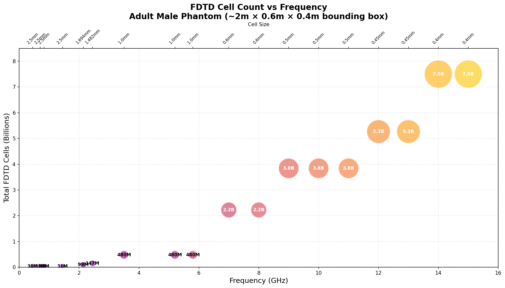

# FDTD Cell Scaling Analysis for Human Phantom Simulations

**Date:** 2026-01-04  
**Frequency Range:** 450 MHz – 15 GHz

---

## Overview

This report analyzes the computational requirements for FDTD simulations of a human body phantom across frequencies from 450 MHz to 15 GHz, based on the gridding parameters defined in the `far_field_config.json` and `far_field_config_high_freq.json` configuration files.

## Grid Configuration

The configurations use manual gridding with frequency-dependent cell sizes:

| Frequency (MHz) | Cell Size (mm) | Source Config |
|-----------------|----------------|---------------|
| 450 – 1450 | 2.5 | far_field_config.json |
| 2140 | 1.694 | far_field_config.json |
| 2450 | 1.482 | far_field_config.json |
| 3500 – 5800 | 1.0 | far_field_config.json |
| 7000 – 8000 | 0.6 | far_field_config_high_freq.json |
| 9000 – 11000 | 0.5 | far_field_config_high_freq.json |
| 12000 – 13000 | 0.45 | far_field_config_high_freq.json |
| 14000 – 15000 | 0.4 | far_field_config_high_freq.json |

## Phantom Dimensions

For an adult male phantom, the assumed bounding box is:

- **Height (L):** 2000 mm
- **Width (W):** 600 mm  
- **Depth (D):** 400 mm

## Cell Count Scaling

FDTD cell count scales **cubically** with decreasing cell size:

$$N_{cells} = \frac{L}{\Delta x} \times \frac{W}{\Delta x} \times \frac{D}{\Delta x}$$

| Frequency | Cell Size | Total Cells | Order of Magnitude |
|-----------|-----------|-------------|-------------------|
| 450 MHz | 2.5 mm | 30.7 M | ~31 million |
| 2450 MHz | 1.48 mm | 147.5 M | ~150 million |
| 5800 MHz | 1.0 mm | 480 M | ~500 million |
| 8000 MHz | 0.6 mm | 2.2 B | ~2.2 billion |
| 12000 MHz | 0.45 mm | 5.3 B | ~5.3 billion |
| 15000 MHz | 0.4 mm | 7.5 B | ~7.5 billion |

## Cells per Wavelength in Tissue

The gridding targets approximately **7–15 cells per wavelength in tissue**, accounting for the reduced wavelength in high-permittivity biological materials (ε_r ≈ 50–55 for muscle).

| Frequency | λ (free space) | λ (tissue, ε_r≈55) | Cell Size | Cells/λ (tissue) |
|-----------|----------------|---------------------|-----------|------------------|
| 2450 MHz | 122 mm | ~16 mm | 1.48 mm | ~11 |
| 5800 MHz | 52 mm | ~7 mm | 1.0 mm | ~7 |
| 15 GHz | 20 mm | ~2.7 mm | 0.4 mm | ~7 |

This is near the minimum typically required for FDTD accuracy (~10 cells/λ).

## Computational Constraints

Taking 8 GHz (~2.2 billion cells) as the practical computational limit, simulations at higher frequencies require **phantom volume reduction**:

| Frequency | Full Phantom Cells | % Phantom Required | Practical Implication |
|-----------|-------------------|-------------------|----------------------|
| 7–8 GHz | 2.2 B | 100% | Full body feasible |
| 9–11 GHz | 3.8 B | ~58% | Legs removed at thigh |
| 12–13 GHz | 5.3 B | ~42% | Torso only (waist up) |
| 14–15 GHz | 7.5 B | ~30% | Upper torso/head only |

## Current Mitigation Strategy

The `far_field_config_high_freq.json` already implements several strategies to manage computational load:

1. **Single phantom:** Uses only `thelonious` (child phantom, smaller volume)
2. **Reduced incidence directions:** Single direction (`x_pos`) instead of all 6
3. **Single polarization:** Only `theta` instead of both polarizations

## Conclusions

1. **Cubic scaling** makes high-frequency whole-body FDTD simulations extremely expensive (250× increase from 450 MHz to 15 GHz).

2. **At 15 GHz**, simulating a full adult phantom would require ~7.5 billion cells, which is impractical for most systems.

3. **Phantom truncation** is necessary above 8 GHz, but becomes severe (>50% reduction) above 11 GHz.

4. **Alternative approaches** for high frequencies may include:
   - Using child phantoms (smaller body volume)
   - Focusing on specific body regions (e.g., head, torso)
   - Accepting coarser resolution with reduced accuracy
   - Hybrid methods combining FDTD with asymptotic techniques

---

*Generated from gridding parameters in GOLIAT far-field configuration files.*
