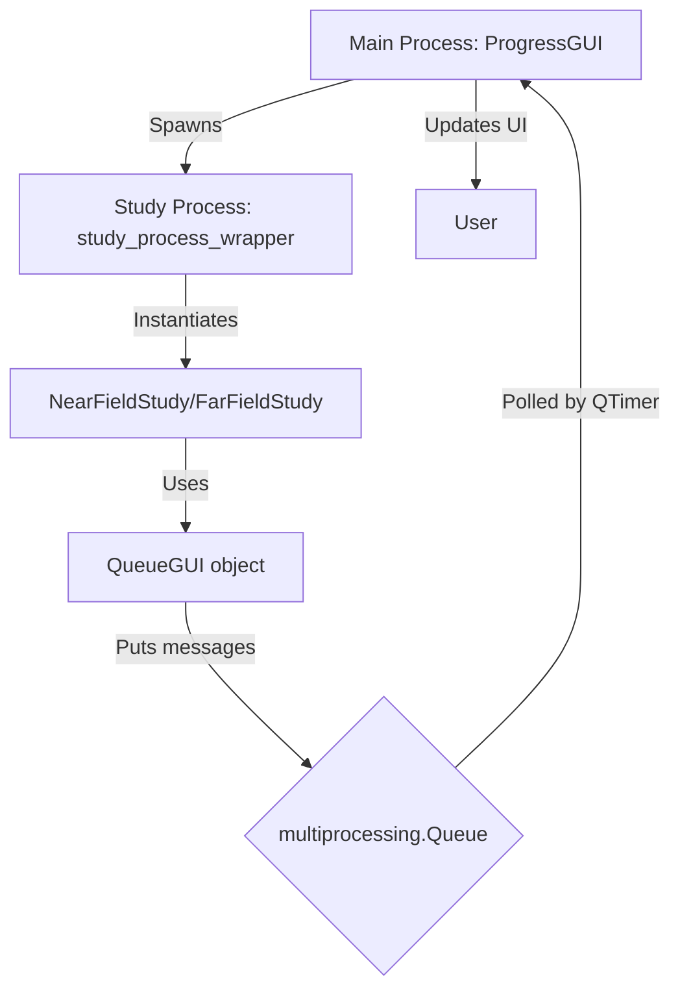

# Advanced features: a deeper dive

This section details the architecture and workflow of the key operational features of the codebase, focusing on the graphical user interface (GUI), logging, session management, and the profiling/timing system.

## 1. High-level workflow

The application is designed to run scientific studies which can be time-consuming. To provide user feedback and manage complexity, the system employs a multi-process architecture.

1.  **Main Process**: A lightweight PySide6 GUI (`ProgressGUI`) is launched. This GUI is responsible for displaying progress, logs, and timing information.
2.  **Study Process**: The actual study (`NearFieldStudy` or `FarFieldStudy`) is executed in a separate process using Python's `multiprocessing` module. This prevents the GUI from freezing during intensive calculations.
3.  **Communication**: The study process communicates with the GUI process through a `multiprocessing.Queue`. It sends messages containing status updates, progress information, and timing data.

The entry point for the study process is the `study_process_wrapper` function, which sets up a special `QueueGUI` object. This object mimics the real GUI's interface but directs all its output to the shared queue.



## 2. GUI and profiling system

The user interface, progress estimation, and timing systems are tightly integrated to provide a responsive and informative experience. The core components are the `ProgressGUI` and the `Profiler`.

### The `ProgressGUI`

The GUI runs in the main process. It uses a `QTimer` to poll a `multiprocessing.Queue` for messages sent from the study process. This design keeps the UI responsive. The GUI is responsible for two primary progress indicators:

-   **Overall Progress**: Tracks the progress of the entire study (e.g., 5 out of 108 simulations complete).
-   **Stage Progress**: Tracks the progress of the current major phase (`setup`, `run`, or `extract`) for the *current* simulation.

### The `Profiler`

The `Profiler` class is the engine for all timing and estimation.

-   **Session-Based Timing**: The profiler maintains a session-specific timing configuration file in the `data/` folder (e.g., `profiling_config_31-10_14-15-30_a1b2c3d4.json`). The filename includes a timestamp prefix followed by a unique hash. This file stores the average time taken for each major phase (`avg_setup_time`, `avg_run_time`, etc.) and for granular subtasks. The session-specific approach means each study run tracks its own timing data, allowing for cleaner session management and avoiding conflicts between concurrent runs.
-   **ETA Calculation**: The `get_time_remaining` method provides the core ETA logic. It calculates the total estimated time for all simulations based on the current session's timing averages and subtracts the time that has already elapsed. This elapsed time is a combination of the total time for already completed simulations and the real-time duration of the current, in-progress simulation.
-   **Weighted Progress**: The `Profiler` calculates the progress within a single simulation by using phase weights. These weights are derived from the average time of each phase in the current session, normalized to sum to 1. This ensures that a longer phase, like `run`, contributes more to the intra-simulation progress than a shorter one, like `extract`.

### The animation system

For long-running phases where the underlying process provides no feedback (like `iSolve.exe`), the GUI employs a smooth animation for the **Stage Progress** bar.

**How it works:**

1.  **Initiation**: When a major phase (e.g., `setup`) begins, the `profile` context manager in the study process retrieves the estimated duration for that entire phase from the `Profiler` (e.g., `avg_setup_time`). It sends a `start_animation` message to the GUI with this duration.

2.  **Animation Execution**: The `ProgressGUI` receives the message. It resets the stage progress bar to 0% and starts a `QTimer` that fires every 50ms.

3.  **Frame-by-Frame Update**: With each tick of the timer, the `update_animation` method calculates the percentage of the estimated duration that has elapsed and updates the stage progress bar to that value. This creates a smooth animation from 0% to 100% over the expected duration of the phase.

4.  **Synchronization**: The `update_animation` method is also responsible for updating the **Overall Progress** bar. On each tick, it asks the `Profiler` for the current weighted progress of the entire study and updates the overall bar accordingly. This keeps both bars synchronized.

5.  **Termination**: When the actual phase completes in the study process, an `end_animation` message is sent. The GUI stops the timer and sets the stage progress bar to its final value of 100%, correcting for any deviation between the estimate and the actual time taken.

This system ensures that even without direct feedback from the core simulation, the user is presented with a constantly updating and reasonably accurate view of the system's progress.

## 3. Logging (`logging_manager.py`)

The system uses Python's standard `logging` module, configured to provide two distinct streams of information.

### Loggers:

1.  **`progress` logger**: For high-level, user-facing messages. These are shown in the GUI and saved to `*.progress.log`.
2.  **`verbose` logger**: For detailed, internal messages. These are saved to the main `*.log` file.

### Implementation details:

*   **Log Rotation**: The `setup_loggers` function checks the number of log files in the `logs` directory. If it exceeds a limit (15 pairs), it deletes the oldest pair (`.log` and `.progress.log`) to prevent the directory from growing indefinitely.
*   **Data File Cleanup**: Similarly, the system automatically manages CSV and JSON files in the `data/` directory (progress tracking and profiling files). When more than 50 such files exist, the oldest files are automatically deleted to prevent excessive disk usage. These files follow the naming pattern `time_remaining_DD-MM_HH-MM-SS_hash.csv`, `overall_progress_DD-MM_HH-MM-SS_hash.csv`, and `profiling_config_DD-MM_HH-MM-SS_hash.json`, where the timestamp allows easy identification of when each session was run.
*   **Handler Configuration**: The function creates file handlers and stream (console) handlers for each logger, ensuring messages go to the right places. `propagate = False` is used to prevent messages from being handled by parent loggers, avoiding duplicate output.

## 4. Configuration (`config.py`)

The `Config` class uses a powerful inheritance mechanism to avoid duplicating settings.

*   **Inheritance**: A config can "extend" a base config. The `_load_config_with_inheritance` method recursively loads the base config and merges it with the child config. The child's values override the parent's.

    For example, `near_field_config.json` might only specify the settings that differ from the main `base_config.json`.

## 5. Project management

*   **`project_manager.py`**: This class is critical for reliability. The underlying `.smash` project files can become corrupted or locked. The `_is_valid_smash_file` method is a key defensive measure. It first attempts to rename the file to itself (a trick to check for file locks on Windows) and then uses `h5py` to ensure the file is a valid HDF5 container before attempting to open it in the simulation software. This prevents the application from crashing on a corrupted file.

## 6. Phantom rotation for `by_cheek` placement

A specialized feature for the `by_cheek` placement scenario is the ability to rotate the phantom to meet the phone, rather than the other way around. This is controlled by a specific dictionary format in the configuration and uses an automatic angle detection algorithm to ensure precise placement.

### Configuration

To enable this feature, the orientation in `placement_scenarios` is defined as a dictionary:

```json
"orientations": {
  "cheek_base": {
    "rotate_phantom_to_cheek": true,
    "angle_offset_deg": 0
  }
}
```

-   `rotate_phantom_to_cheek`: A boolean that enables or disables the phantom rotation.
-   `angle_offset_deg`: An integer that specifies an additional rotation away from the cheek (0 being the default).

### Automatic angle detection

The system uses a binary search algorithm to find the exact angle at which the phantom's "Skin" entity touches the phone's ground plane. This is handled by the `_find_touching_angle` method in `src/setups/near_field_setup.py`. The search is performed between 0 and 30 degrees with a precision of 0.5 degrees.

### Workflow integration

The phantom rotation is handled in the `NearFieldSetup.run_full_setup` method, occurring after the antenna is placed but before the final scene alignment. This ensures that the phone is positioned correctly relative to the un-rotated phantom, after which the phantom is rotated into the final position.

## 7. The `Verify and Resume` caching system

GOLIAT integrates a `Verify and Resume` feature to prevent redundant computations by caching simulation results. The system intelligently determines whether a simulation with an identical configuration has already been successfully completed, skipping re-runs and saving significant time.

### Verification workflow

The verification logic is multi-tiered, prioritizing the integrity of the final result files ("deliverables") over simple metadata flags. This ensures robustness against interrupted runs or manual file deletions.

1.  **Configuration hashing**: Before verification, a "surgical" configuration is created. This is a snapshot containing only the parameters relevant to a single, specific simulation run (e.g., one phantom, one frequency, one placement). This configuration is then serialized and hashed (SHA256), producing a unique fingerprint that represents the exact setup.

2.  **Metadata and deliverable validation**: The core logic resides in `ProjectManager.create_or_open_project`, which is called at the start of each simulation. It performs a sequence of checks:
    *   **Hash comparison**: The hash of the current surgical configuration is compared against the `config_hash` stored in the `config.json` metadata file within the simulation's results directory. A mismatch signifies that the configuration has changed, rendering the cached results invalid and triggering a full re-run.
    *   **`.smash` file integrity**: If the hashes match, the system validates the `.smash` project file itself. This is a critical step for stability, as these files can become locked or corrupted. The validation involves checking for `.s4l_lock` files and verifying the HDF5 structure with `h5py`. A missing or corrupt `.smash` file indicates that the setup phase is incomplete.
    *   **Deliverable verification**: This is the definitive check. The system looks for the actual output files generated by the `run` and `extract` phases. It verifies not only their existence but also that their modification timestamps are newer than the `setup_timestamp` recorded in the metadata.
        *   **Run phase deliverables**: A valid `*_Output.h5` file.
        *   **Extract phase deliverables**: `sar_results.json`, `sar_stats_all_tissues.pkl`, and `sar_stats_all_tissues.html`.

3.  **Status reporting and phase skipping**: The verification process returns a detailed status dictionary, such as `{'setup_done': True, 'run_done': True, 'extract_done': False}`. The study orchestrator (`NearFieldStudy` or `FarFieldStudy`) uses this status to dynamically skip phases that are already complete. For instance, if `run_done` is `True`, the `do_run` flag for that specific simulation is internally set to `False`, and the run phase is skipped.

4.  **Metadata update**: Upon the successful completion of the `run` and `extract` phases, the `BaseStudy._verify_and_update_metadata` method is triggered. It re-confirms that the deliverables exist on the file system and then updates the `run_done` or `extract_done` flags in the `config.json` file to `true`. This ensures the metadata accurately reflects the state of the deliverables for future runs.

This deliverable-first approach is a key design choice. It guarantees that the system is resilient; even if the metadata file claims a phase is complete, the absence of the actual result files will correctly force the system to re-run the necessary steps.

### Overriding the cache

The entire caching and verification mechanism can be bypassed using the `--no-cache` command-line flag.

```bash
python run_study.py --config configs/my_study.json --no-cache
```

When this flag is active, GOLIAT will ignore any existing project files or metadata. It skips the verification process, deletes any existing `.smash` file for the target simulation, and executes all phases (setup, run, extract) from a clean state. This is the recommended approach for debugging, validating changes, or when a fresh run is explicitly required.