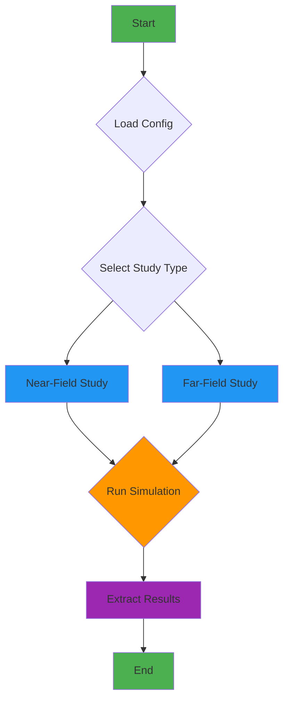
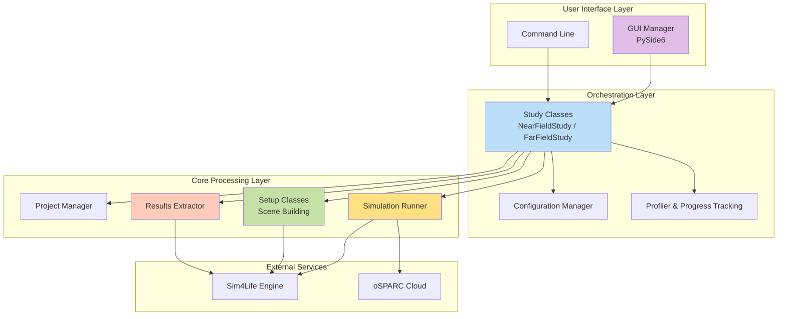
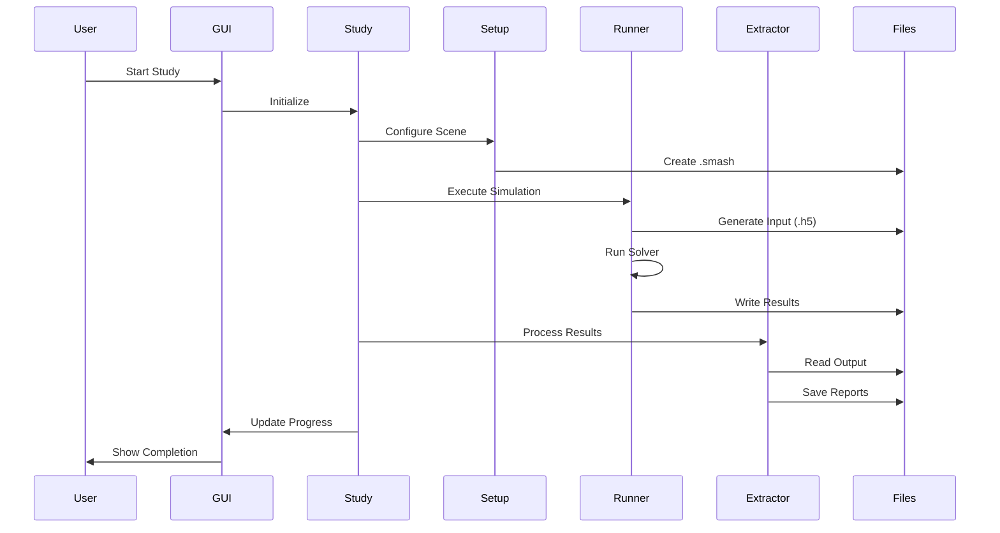
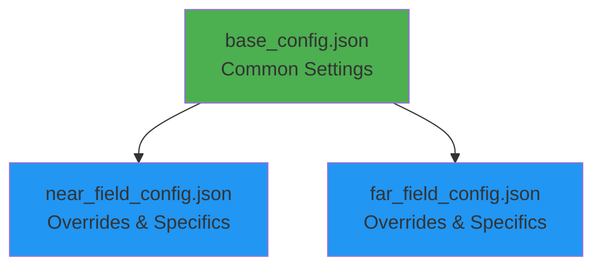

# Architecture Overview

This document provides a high-level overview of the GOLIAT project's architecture.

## Workflow

The application follows a clear, modular workflow from configuration to results. The core logic is orchestrated by **Study** classes, which manage the entire simulation lifecycle.

## System Architecture

## Component Interactions

## Key Components

### Entry Points

**`run_study.py`**:
:   The main entry point. Launches GUI and study process.

**`run_study_no_gui.py`**:
:   Headless CLI for batch/automation.

### Core Classes

**`Config`**:
:   Loads JSON configs with inheritance.

**`NearFieldStudy` / `FarFieldStudy`**:
:   Orchestrate workflow: Loop over parameters, call setups/runner/extractor.

**`ProjectManager`**:
:   Manages .smash files (create/open/save/close, lock handling).

### Setup Components

**`NearFieldSetup` / `FarFieldSetup`**:
:   Build scene: Phantoms, antennas/sources, materials, gridding, boundaries.

**`PhantomSetup`**:
:   Loads voxel models.

**`PlacementSetup`**:
:   Positions antennas.

**`MaterialSetup`**:
:   Assigns tissue/material properties.

**`GriddingSetup`**:
:   Sets grid resolution.

**`BoundarySetup`**:
:   Configures PML boundaries.

**`SourceSetup`**:
:   Adds excitations/sensors.

### Execution Components

**`SimulationRunner`**:
:   Runs iSolve (local) or submits to oSPARC.

**`ResultsExtractor`**:
:   Extracts SAR, power balance, point sensors.

### Analysis Components

**`Analyzer`**:
:   Aggregates results using strategies (near/far-field).

**`Plotter`**:
:   Generates heatmaps, bars, boxplots.

### UI Components

**`GuiManager`**:
:   Progress window with multiprocessing queue.

**`Profiler`**:
:   Estimates ETA based on phase weights.

## Configuration Hierarchy

For detailed information, refer to the [API Reference](api.md).