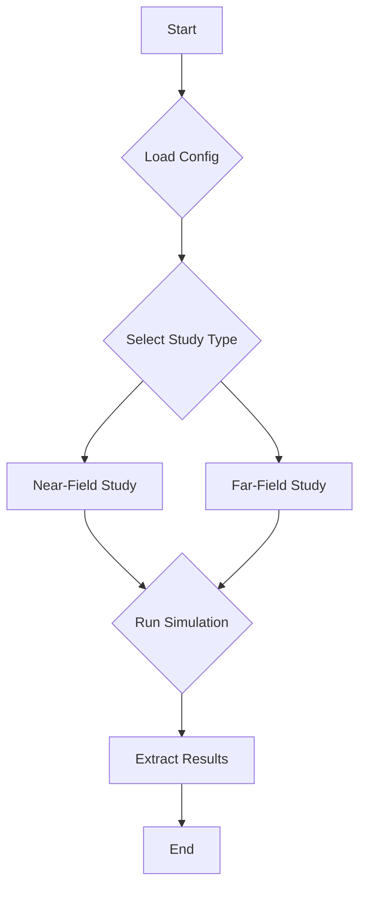

# Architecture Overview

This document provides a high-level overview of the GOLIAT project's architecture.

## Workflow

The application follows a clear, modular workflow from configuration to results. The core logic is orchestrated by **Study** classes, which manage the entire simulation lifecycle.

## Key Components

*   **`run_study.py`:** The main entry point of the application. It handles the GUI and launches the study in a separate process.
*   **`Config`:** A class that handles loading and validation of configuration files with inheritance.
*   **`NearFieldStudy` / `FarFieldStudy`:** These classes orchestrate the entire simulation workflow for their respective study types.
*   **`ProjectManager`:** Manages the Sim4Life project file (`.smash`).
*   **`NearFieldSetup` / `FarFieldSetup`:** These classes build the simulation scene.
*   **`SimulationRunner`:** Executes the simulation.
*   **`ResultsExtractor`:** Performs post-processing and data extraction.
*   **`GuiManager`:** Provides a real-time progress window using PySide6.

For more detailed information, please refer to the [API Reference](api.md).