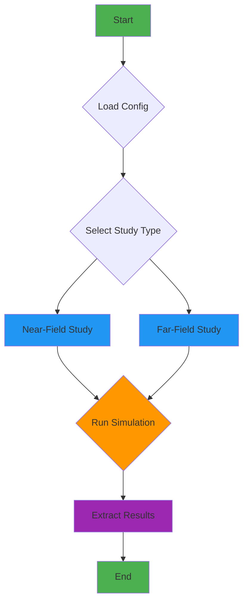
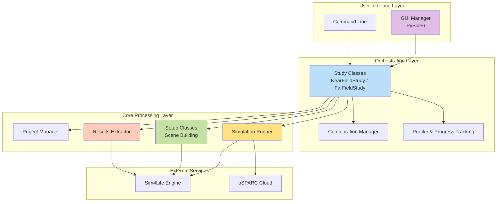
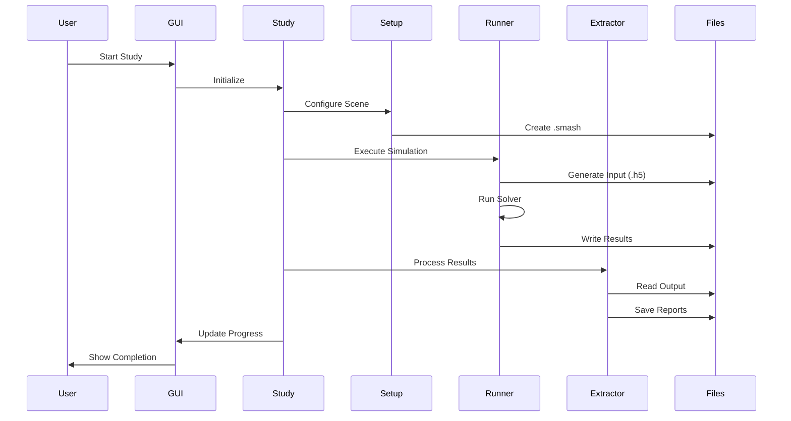
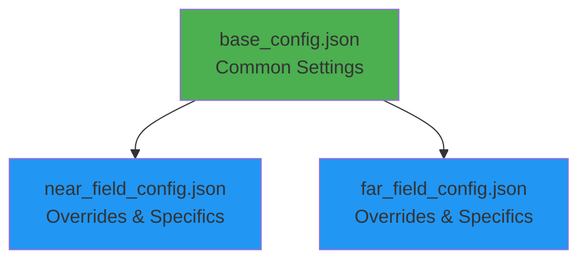

# Architecture Overview

This document provides a high-level overview of the GOLIAT project's architecture.

## Workflow

The application follows a clear, modular workflow from configuration to results. The core logic is orchestrated by **Study** classes, which manage the entire simulation lifecycle.

## System Architecture

## Key Components

### Entry Points

**`run_study.py`**
:   The main entry point of the application. It handles the GUI and launches the study in a separate process to maintain UI responsiveness.

**`run_study_no_gui.py`**
:   Command-line interface for headless execution, ideal for batch processing and automation.

### Core Classes

**`Config`**
:   Handles loading and validation of configuration files with hierarchical inheritance. Supports extending base configurations for easy customization.

**`NearFieldStudy` / `FarFieldStudy`**
:   Orchestrate the entire simulation workflow for their respective study types. These classes coordinate all phases: setup, execution, and post-processing.

**`ProjectManager`**
:   Manages the Sim4Life project file (`.smash`). Includes validation checks to prevent corruption and handles file locking on Windows.

### Setup Components

**`NearFieldSetup` / `FarFieldSetup`**
:   Build the simulation scene by:
    
    - Importing and positioning phantoms
    - Placing antennas or configuring plane waves
    - Setting up materials and boundary conditions
    - Configuring solver parameters

**`PhantomSetup`**
:   Handles phantom model loading and validation.

**`PlacementSetup`**
:   Manages antenna positioning relative to phantom models with precise distance and orientation control.

**`MaterialSetup`**
:   Assigns material properties to all entities in the simulation.

**`GriddingSetup`**
:   Configures spatial discretization with main grids and subgrids for accurate field computation.

**`BoundarySetup`**
:   Defines boundary conditions for the simulation domain.

**`SourceSetup`**
:   Configures electromagnetic sources (antennas or plane waves).

### Execution Components

**`SimulationRunner`**
:   Executes simulations with support for:
    
    - Local manual execution (generates input files)
    - Local automated execution (runs iSolve directly)
    - Cloud execution (submits to oSPARC)

**`ResultsExtractor`**
:   Performs post-processing and data extraction:
    
    - SAR field extraction and statistics
    - Power balance analysis
    - Tissue-specific metrics
    - Report generation

### Analysis Components

**`Analyzer`**
:   Processes extracted results and generates comprehensive reports.

**`Plotter`**
:   Creates visualizations including heatmaps, bar charts, and distribution plots.

### UI Components

**`GuiManager`**
:   Provides a real-time progress window using PySide6 with:
    
    - Live progress bars
    - Status updates
    - ETA calculations
    - System tray integration

**`Profiler`**
:   Tracks execution time and provides increasingly accurate time estimates based on historical data.

## Data Flow

## Configuration Hierarchy

GOLIAT uses a hierarchical JSON configuration system that prevents duplication:

This allows you to:

- Define common settings once in `base_config.json`
- Override specific parameters in study-specific configs
- Maintain multiple configurations easily

For more detailed information, please refer to the [API Reference](api.md).