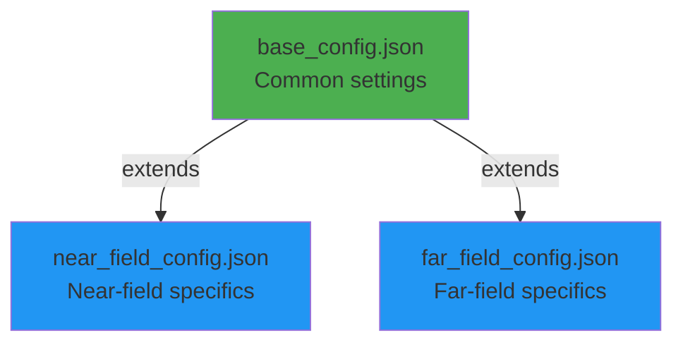

# Configuration Guide

GOLIAT uses a hierarchical JSON configuration system to define simulation parameters. Study-specific configs (e.g., `near_field_config.json`) inherit from `base_config.json`, allowing overrides for specific studies. This guide details all parameters, with examples.

## Configuration Hierarchy

The system supports inheritance to avoid repetition:



A study config specifies `"extends": "base_config.json"` and overrides as needed.

## Base Configuration (`base_config.json`)

Core settings shared across studies.

### Core Settings

| Parameter | Type | Example | Description |
|-----------|------|---------|-------------|
| `extends` | string | `"base_config.json"` | Parent config to inherit from. |
| `study_type` | string | `"near_field"` | Type: `"near_field"` or `"far_field"`. |
| `phantoms` | array | `["thelonious", "eartha"]` | List of phantom models. For near-field, can include `"freespace"` for antenna-only runs. |
| `execution_control` | object | See below | Controls workflow stages. |

### Execution Control

Booleans to run specific phases:

| Parameter | Type | Default | Description |
|-----------|------|---------|-------------|
| `execution_control.do_setup` | boolean | `true` | Build simulation scene. |
| `execution_control.do_run` | boolean | `true` | Execute simulations. |
| `execution_control.do_extract` | boolean | `true` | Extract and normalize results. |
| `execution_control.only_write_input_file` | boolean | `false` | Generate .h5 inputs without running (for manual/cloud upload). |
| `execution_control.batch_run` | boolean | `false` | Enable oSPARC batch submission (advanced). |

Example for extraction only:

```json
"execution_control": {
  "do_setup": false,
  "do_run": false,
  "do_extract": true
}
```

### Simulation Parameters

General simulation settings.

| Parameter | Type | Example | Description |
|-----------|------|---------|-------------|
| `simulation_parameters.excitation_type` | string | `"Harmonic"` | Excitation: `"Harmonic"` (single frequency) or `"Gaussian"` (sweep; for antenna characterization). |
| `simulation_parameters.bandwidth_mhz` | number | `50.0` | Bandwidth for Gaussian (MHz). |
| `simulation_parameters.global_auto_termination` | string | `"GlobalAutoTerminationUserDefined"` | Termination: `"GlobalAutoTerminationWeak"` (default) or `"GlobalAutoTerminationUserDefined"` (custom dB). |
| `simulation_parameters.convergence_level_dB` | number | `-15` | Convergence threshold (dB) for user-defined termination. |
| `simulation_parameters.simulation_time_multiplier` | number | `5` | Multiplier for time calculation: diagonal length / c * multiplier. |
| `simulation_parameters.number_of_point_sensors` | number | `8` | Point sensors at bounding box corners for field monitoring. |
| `simulation_parameters.point_source_order` | array | `["lower_left_bottom", ...]` | Order of 8 corner points for sensors. |
| `simulation_parameters.bbox_padding_mm` | number | `50` | Padding around phantom for simulation domain (far-field). |
| `simulation_parameters.freespace_antenna_bbox_expansion_mm` | array | `[20, 20, 20]` | Padding for free-space antenna runs [x, y, z] mm. |

### Gridding Parameters

Spatial discretization.

#### Global Gridding

| Parameter | Type | Example | Description |
|-----------|------|---------|-------------|
| `gridding_parameters.global_gridding.grid_mode` | string | `"automatic"` | `"automatic"` (default) or `"manual"`. |
| `gridding_parameters.global_gridding.refinement` | string | `"AutoRefinementDefault"` | Auto levels: `"VeryFine"`, `"Fine"`, `"Default"`, `"Coarse"`, `"VeryCoarse"`. |
| `gridding_parameters.global_gridding.manual_fallback_max_step_mm` | number | `5.0` | Max grid step mm (manual mode). |
| `gridding_parameters.global_gridding_per_frequency` | object | `{"700": 3.0}` | Frequency-specific manual steps (e.g., finer at higher freqs). |

#### Padding

| Parameter | Type | Example | Description |
|-----------|------|---------|-------------|
| `gridding_parameters.padding.padding_mode` | string | `"automatic"` | `"automatic"` or `"manual"`. |
| `gridding_parameters.padding.manual_bottom_padding_mm` | array | `[0, 0, 0]` | Bottom padding [x, y, z] mm. |
| `gridding_parameters.padding.manual_top_padding_mm` | array | `[0, 0, 0]` | Top padding [x, y, z] mm. |

### Solver Settings

| Parameter | Type | Example | Description |
|-----------|------|---------|-------------|
| `solver_settings.kernel` | string | `"Acceleware"` | `"Software"` (CPU), `"Acceleware"` (GPU, default for near-field), `"CUDA"` (GPU, faster but no SIBC for near-field). |
| `solver_settings.boundary_conditions.type` | string | `"UpmlCpml"` | Boundary type. |
| `solver_settings.boundary_conditions.strength` | string | `"Medium"` | PML strength: `"Weak"`, `"Medium"`, `"Strong"`. |

### Other Settings

| Parameter | Type | Example | Description |
|-----------|------|---------|-------------|
| `manual_isolve` | boolean | `true` | Run iSolve.exe directly (recommended; avoids Ares bug). |
| `download_email` | string | `"user@example.com"` | Email for phantom downloads. |
| `export_material_properties` | boolean | `false` | Export material props to PKL (advanced). |

## Far-Field Configuration (`far_field_config.json`)

Extends base for far-field specifics.

### Study Setup

| Parameter | Type | Example | Description |
|-----------|------|---------|-------------|
| `frequencies_mhz` | array | `[450, 700]` | Frequencies MHz. |
| `far_field_setup.type` | string | `"environmental"` | `"environmental"` (plane waves) or `"auto_induced"` (body-motion induced; limited). |
| `far_field_setup.environmental.incident_directions` | array | `["x_pos", "y_neg"]` | Single-axis directions: `"x_pos"`, `"x_neg"`, `"y_pos"`, `"y_neg"`, `"z_pos"`, `"z_neg"`. No combinations like "xy_pos". |
| `far_field_setup.environmental.polarizations` | array | `["theta", "phi"]` | Polarizations: `"theta"` (vertical), `"phi"` (horizontal). |

**Note**: Only 6 directions supported (x±, y±, z±). For environmental, 12 simulations per freq (6 × 2).

### Example Far-Field Config

```json
{
  "extends": "base_config.json",
  "study_type": "far_field",
  "phantoms": ["thelonious"],
  "frequencies_mhz": [700],
  "far_field_setup": {
    "type": "environmental",
    "environmental": {
      "incident_directions": ["x_pos", "y_pos"],
      "polarizations": ["theta"]
    }
  }
}
```

## Near-Field Configuration (`near_field_config.json`)

Extends base for near-field.

### Study Setup

| Parameter | Type | Example | Description |
|-----------|------|---------|-------------|
| `frequencies_mhz` | array | `[700, 900]` | Frequencies MHz. |
| `simulation_parameters.freespace_antenna_bbox_expansion_mm` | array | `[20, 20, 20]` | Free-space padding [x, y, z] mm. |

### Antenna Configuration

Per-frequency settings:

```json
"antenna_config": {
  "700": {
    "model_type": "PIFA",
    "source_name": "Lines 1",
    "materials": {
      "Extrude 1": "Copper (Annealed)",
      "Extrude 2": "FR4 (Circuit Board)"
    },
    "gridding": {
      "automatic": ["Extrude 2"],
      "manual": {
        "Extrude 1": 0.5
      }
    }
  }
}
```

- `model_type`: `"PIFA"` or `"IFA"` (selects logic).
- `source_name`: Source entity in CAD.
- `materials`: CAD component to Sim4Life material.
- `gridding`: Auto/manual per component.

**Note**: Antenna configs fixed for GOLIAT; modify for custom models.

### Placement Scenarios

Define positions/orientations:

```json
"placement_scenarios": {
  "by_cheek": {
    "positions": {"base": [0, 0, 0]},
    "orientations": {"base": [], "up": [{"axis": "X", "angle_deg": 10}]}
  }
}
```

### Phantom-Specific Settings

Per-phantom placements/distances:

```json
"phantom_definitions": {
  "thelonious": {
    "placements": {
      "do_by_cheek": true
    },
    "distance_from_cheek": 8
  }
}
```

### Example Near-Field Config

```json
{
  "extends": "base_config.json",
  "study_type": "near_field",
  "phantoms": ["thelonious"],
  "frequencies_mhz": [700],
  "phantom_definitions": {
    "thelonious": {
      "placements": {
        "do_by_cheek": true
      },
      "distance_from_cheek": 8
    }
  }
}
```

## oSPARC Cloud Settings

Credentials in `.env` (not config for security).

Batch workflow:
1. `"only_write_input_file": true` – Generate .h5 files.
2. `"batch_run": true` – Submit to oSPARC.
3. `"do_extract": true` – Process results.

Example batch config:

```json
"execution_control": {
  "do_setup": true,
  "only_write_input_file": true,
  "do_run": false,
  "do_extract": false,
  "batch_run": false
}
```

## Line Profiling (Advanced)

Enable in config:

```json
"line_profiling": {
  "enabled": true,
  "subtasks": {
    "setup_simulation": ["src.setups.base_setup.BaseSetup._finalize_setup"]
  }
}
```

## Example Custom Config

Create `configs/my_study.json`:

```json
{
  "extends": "base_config.json",
  "study_type": "near_field",
  "phantoms": ["eartha"],
  "frequencies_mhz": [900, 1800],
  "phantom_definitions": {
    "eartha": {
      "placements": {
        "do_front_of_eyes": true
      },
      "distance_from_eye": 200
    }
  }
}
```

Run: `python run_study.py --config configs/my_study.json`.

For full details, see [User Guide](../user_guide.md).

---
*Last updated: {date}*