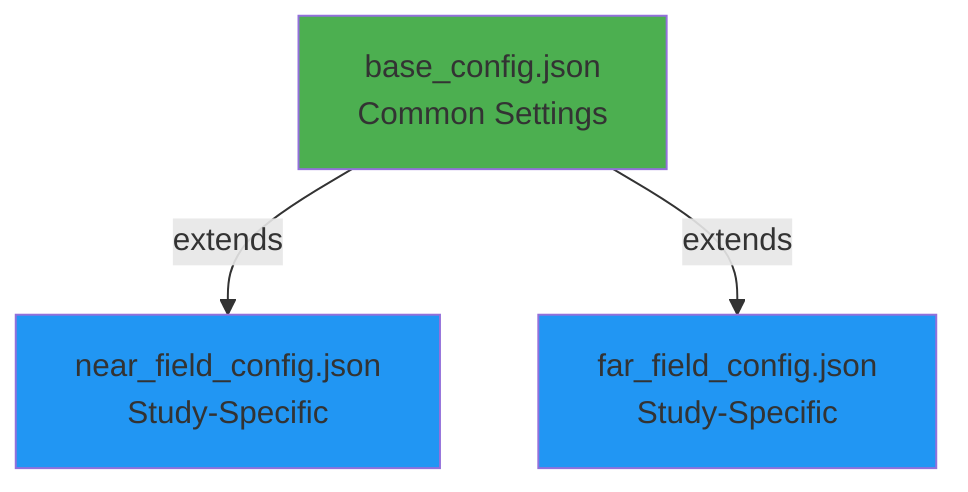

# Configuration Guide

The GOLIAT framework uses a hierarchical JSON configuration system that provides flexibility while avoiding duplication. This guide covers all available configuration parameters.

## Configuration Hierarchy

The configuration system uses inheritance to prevent duplication:



A study-specific config (e.g., [`near_field_config.json`](https://github.com/rwydaegh/goliat/blob/master/configs/near_field_config.json)) inherits from [`base_config.json`](https://github.com/rwydaegh/goliat/blob/master/configs/base_config.json) and can override any parameter.

## Base Configuration

### Core Settings

| Parameter | Type | Example | Description |
|-----------|------|---------|-------------|
| `extends` | string | `"base_config.json"` | Parent configuration file to inherit from |
| `study_type` | string | `"near_field"` | Study type: `"near_field"` or `"far_field"` |
| `phantoms` | array | `["thelonious", "Eartha"]` | List of virtual human phantom models to simulate |

### Execution Control

Control which phases of the workflow are executed:

| Parameter | Type | Default | Description |
|-----------|------|---------|-------------|
| `execution_control.do_setup` | boolean | `true` | Create and configure simulation projects |
| `execution_control.do_run` | boolean | `true` | Execute the simulations |
| `execution_control.do_extract` | boolean | `true` | Post-process and extract results |
| `execution_control.only_write_input_file` | boolean | `false` | Generate solver input files without running |
| `execution_control.batch_run` | boolean | `false` | Enable batch processing for oSPARC |

!!! tip "Workflow Control"
    Use these flags to re-run specific phases. For example, set `do_setup: false` and `do_extract: true` to only extract results from existing simulations.

### Simulation Parameters

| Parameter | Type | Example | Description |
|-----------|------|---------|-------------|
| `simulation_parameters.excitation_type` | string | `"Harmonic"` | Excitation type: `"Harmonic"` or `"Gaussian"` |
| `simulation_parameters.bandwidth_mhz` | number | `50.0` | Bandwidth for Gaussian excitation (MHz) |
| `simulation_parameters.global_auto_termination` | string | `"GlobalAutoTerminationUserDefined"` | FDTD termination criteria |
| `simulation_parameters.convergence_level_dB` | number | `-15` | Convergence level for user-defined termination (dB) |
| `simulation_parameters.simulation_time_multiplier` | number | `5` | Multiplier for simulation time calculation |
| `simulation_parameters.number_of_point_sensors` | number | `8` | Number of field monitoring point sensors |
| `simulation_parameters.bbox_padding_mm` | number | `50` | Padding around phantom bounding box (mm) |

!!! note "Simulation Time"
    The simulation time is calculated as: `longest_diagonal / speed_of_light × simulation_time_multiplier`

### Gridding Parameters

#### Global Gridding

| Parameter | Type | Example | Description |
|-----------|------|---------|-------------|
| `gridding_parameters.global_gridding.grid_mode` | string | `"automatic"` | Grid strategy: `"automatic"` or `"manual"` |
| `gridding_parameters.global_gridding.refinement` | string | `"AutoRefinementDefault"` | Refinement level for automatic gridding |
| `gridding_parameters.global_gridding.manual_fallback_max_step_mm` | number | `5.0` | Maximum grid step for manual mode (mm) |

!!! info "Refinement Levels"
    Available levels: `AutoRefinementVeryFine`, `AutoRefinementFine`, `AutoRefinementDefault`, `AutoRefinementCoarse`, `AutoRefinementVeryCoarse`

#### Padding

| Parameter | Type | Example | Description |
|-----------|------|---------|-------------|
| `gridding_parameters.padding.padding_mode` | string | `"automatic"` | Padding strategy: `"automatic"` or `"manual"` |

### Solver Settings

| Parameter | Type | Example | Description |
|-----------|------|---------|-------------|
| `solver_settings.kernel` | string | `"Acceleware"` | GPU kernel: `"Software"`, `"Acceleware"`, or `"CUDA"` |
| `solver_settings.boundary_conditions.type` | string | `"UpmlCpml"` | Boundary condition type |
| `solver_settings.boundary_conditions.strength` | string | `"Medium"` | Boundary strength: `"Weak"`, `"Medium"`, `"Strong"` |

!!! warning "Kernel Selection"
    - `"Software"`: CPU-only (slow but portable)
    - `"Acceleware"`: GPU-accelerated (required for near-field with SIBC)
    - `"CUDA"`: GPU-accelerated (faster but not compatible with SIBC)

### Other Settings

| Parameter | Type | Example | Description |
|-----------|------|---------|-------------|
| `manual_isolve` | boolean | `true` | Run iSolve directly (always use `true`) |
| `download_email` | string | `"user@example.com"` | Email for phantom model downloads |
| `export_material_properties` | boolean | `false` | Export material properties to files |

## Far-Field Configuration

Additional parameters for far-field studies:

### Study Setup

| Parameter | Type | Example | Description |
|-----------|------|---------|-------------|
| `frequencies_mhz` | array | `[450, 700, 900, 1450, 1800, 2100, 2600]` | Frequencies to simulate (MHz) |
| `far_field_setup.type` | string | `"environmental"` | Scenario type |
| `far_field_setup.environmental.incident_directions` | array | `["x_pos", "y_neg", "z_pos"]` | Plane wave incident directions |
| `far_field_setup.environmental.polarizations` | array | `["theta", "phi"]` | Wave polarizations |

!!! info "Incident Directions"
    Available directions: `x_pos`, `x_neg`, `y_pos`, `y_neg`, `z_pos`, `z_neg`, and combinations like `xy_pos`

!!! info "Polarizations"
    - `"theta"`: Vertical polarization (elevation angle)
    - `"phi"`: Horizontal polarization (azimuthal angle)

### Frequency-Specific Gridding

```json
{
  "gridding_parameters": {
    "global_gridding_per_frequency": {
      "450": 8.021,
      "700": 5.141,
      "900": 4.004
    }
  }
}
```

## Near-Field Configuration

Additional parameters for near-field studies:

### Study Setup

| Parameter | Type | Example | Description |
|-----------|------|---------|-------------|
| `frequencies_mhz` | array | `[700, 900, 1450, 1800, 2100, 2600]` | Frequencies to simulate (MHz) |
| `simulation_parameters.freespace_antenna_bbox_expansion_mm` | array | `[20, 20, 20]` | Padding for free-space simulations [x, y, z] |

!!! tip "Free-Space Simulations"
    To simulate an antenna without a phantom, set `phantoms: ["freespace"]`

### Antenna Configuration

Each frequency has its own antenna configuration:

```json
{
  "antenna_config": {
    "700": {
      "model_type": "PIFA",
      "source_name": "Lines 1",
      "materials": {
        "Extrude 1": "Copper (Annealed)",
        "Extrude 2": "FR4 (Circuit Board)"
      },
      "gridding": {
        "automatic": ["Extrude 1"],
        "manual": {
          "Extrude 2": 0.5
        }
      }
    }
  }
}
```

| Field | Type | Description |
|-------|------|-------------|
| `model_type` | string | Antenna type: `"PIFA"`, `"IFA"`, etc. |
| `source_name` | string | Name of the electromagnetic source entity |
| `materials` | object | Maps CAD components to Sim4Life materials |
| `gridding.automatic` | array | Components using automatic gridding |
| `gridding.manual` | object | Components with manual grid step sizes (mm) |

### Placement Scenarios

Define device placement scenarios:

```json
{
  "placement_scenarios": {
    "front_of_eyes": {
      "positions": {
        "center": [0, 0, 0],
        "left": [-30, 0, 0],
        "right": [30, 0, 0]
      },
      "orientations": {
        "vertical": [0, 0, 0],
        "horizontal": [0, 0, 90],
        "tilted": [0, 15, 0]
      }
    }
  }
}
```

### Phantom-Specific Settings

Configure which placements to use per phantom:

```json
{
  "phantoms": {
    "thelonious": {
      "placements": {
        "do_front_of_eyes": true,
        "do_by_cheek": true,
        "do_by_belly": false
      },
      "distance_from_eye": 200,
      "distance_from_cheek": 8,
      "distance_from_belly": 100
    }
  }
}
```

| Parameter | Type | Description |
|-----------|------|-------------|
| `placements.do_*` | boolean | Enable/disable specific placement scenarios |
| `distance_from_eye` | number | Separation distance for eye placement (mm) |
| `distance_from_cheek` | number | Separation distance for cheek placement (mm) |
| `distance_from_belly` | number | Separation distance for belly placement (mm) |

## Cloud Computing (oSPARC)

### Environment Variables

For security, oSPARC credentials are stored in environment variables (`.env` file):

```bash
OSPARC_API_KEY="your_api_key_here"
OSPARC_API_SECRET="your_api_secret_here"
OSPARC_API_SERVER="https://api.sim4life.science"
OSPARC_API_VERSION="v0"
```

!!! warning "Security"
    Never commit the `.env` file to version control. It's automatically ignored via `.gitignore`.

### Batch Processing Workflow

1. **Generate Input Files**
   ```json
   {
     "execution_control": {
       "do_setup": true,
       "only_write_input_file": true,
       "do_run": false,
       "do_extract": false,
       "batch_run": false
     }
   }
   ```

2. **Submit to oSPARC**
   ```json
   {
     "execution_control": {
       "batch_run": true
     }
   }
   ```

3. **Extract Results**
   ```json
   {
     "execution_control": {
       "do_setup": false,
       "do_run": false,
       "do_extract": true,
       "batch_run": false
     }
   }
   ```

## Advanced Features

### Line Profiling

Enable detailed performance profiling:

```json
{
  "line_profiling": {
    "enabled": true,
    "subtasks": {
      "setup_simulation": [
        "src.setups.base_setup.BaseSetup._finalize_setup",
        "src.setups.material_setup.MaterialSetup.assign_materials"
      ]
    }
  }
}
```

## Configuration Examples

### Minimal Near-Field Study

```json
{
  "extends": "base_config.json",
  "study_type": "near_field",
  "phantoms": ["thelonious"],
  "frequencies_mhz": [900],
  "execution_control": {
    "do_setup": true,
    "do_run": true,
    "do_extract": true
  }
}
```

### Far-Field with Multiple Frequencies

```json
{
  "extends": "base_config.json",
  "study_type": "far_field",
  "phantoms": ["thelonious", "Eartha"],
  "frequencies_mhz": [700, 900, 1800],
  "far_field_setup": {
    "type": "environmental",
    "environmental": {
      "incident_directions": ["x_pos", "y_pos", "z_pos"],
      "polarizations": ["theta", "phi"]
    }
  }
}
```

## Configuration Files Location

All configuration files are stored in the [`configs/`](https://github.com/rwydaegh/goliat/tree/master/configs) directory:

- [`base_config.json`](https://github.com/rwydaegh/goliat/blob/master/configs/base_config.json) - Shared settings
- [`near_field_config.json`](https://github.com/rwydaegh/goliat/blob/master/configs/near_field_config.json) - Near-field template
- [`far_field_config.json`](https://github.com/rwydaegh/goliat/blob/master/configs/far_field_config.json) - Far-field template
- [`profiling_config.json`](https://github.com/rwydaegh/goliat/blob/master/configs/profiling_config.json) - Performance profiling settings

!!! tip "Creating Custom Configs"
    Create your own configuration by copying a template and modifying only the parameters you need to change. The inheritance system will handle the rest.