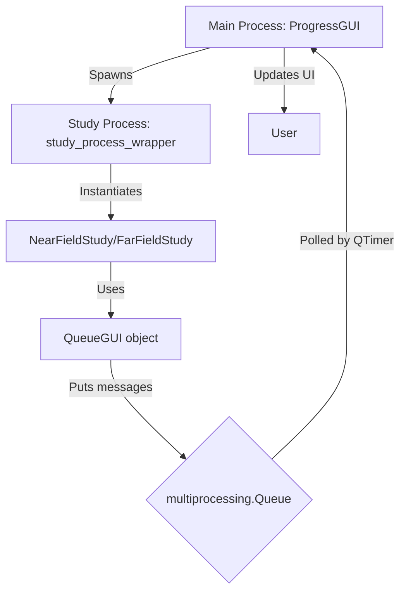

# Developer Guide

This guide is for developers extending or maintaining GOLIAT. It covers the codebase structure, testing, and contribution process. GOLIAT is modular Python code interfacing with Sim4Life for EMF simulations.

## Codebase structure

GOLIAT's architecture separates concerns:

- **src/config.py**: Loads JSON configs with inheritance (e.g., base + study-specific).
- **src/studies/**: Orchestrates workflows (NearFieldStudy, FarFieldStudy inherit from BaseStudy).
- **src/setups/**: Builds Sim4Life scenes (PhantomSetup, PlacementSetup, MaterialSetup, etc.).
- **src/project_manager.py**: Handles .smash files (create/open/save/close).
- **src/simulation_runner.py**: Executes simulations (local iSolve or oSPARC cloud).
- **src/results_extractor.py**: Extracts SAR/power data post-simulation.
- **src/analysis/**: Aggregates results (Analyzer with strategies for near/far-field).
- **src/gui_manager.py**: Multiprocessing GUI for progress/ETA.
- **src/logging_manager.py**: Dual loggers (progress/verbose) with colors.
- **src/profiler.py**: Tracks phases (setup/run/extract) for ETAs.
- **src/utils.py**: Helpers (format_time, non_blocking_sleep, simple Profiler).

Key flow: Config → BaseStudy.run() → Setups → Runner → Extractor → Analyzer.

### Profiling

Two profilers:
- **src/profiler.py**: Phase-based (setup/run/extract weights in profiling_config.json). Tracks ETAs.
  - Methods: `start_stage()`, `end_stage()`, `get_time_remaining()`.
- **src/utils.py Profiler**: Simple timing for subtasks (average_run_time in config).

Enable line profiling in config:

```json
"line_profiling": {
  "enabled": true,
  "subtasks": {
    "setup_simulation": ["src.setups.base_setup.BaseSetup._finalize_setup"]
  }
}
```

Run with kernprof: `kernprof -l -v run_study.py`.

**Profiling and Timing Deep-Dive**:

The `Profiler` class is the engine for the timing and progress estimation system.

*   **Phases and Weights**: A study is divided into phases (`setup`, `run`, `extract`). `profiling_config.json` assigns a "weight" to each, representing its contribution to the total time.
  ```json
  // from configs/profiling_config.json
  {
      "phase_weights": {
        "setup": 0.299,
        "run": 0.596,
        "extract": 0.105
      },
      "subtask_estimates": {
        "setup_simulation": 48.16,
        "run_simulation_total": 107.54,
        "extract_sar_statistics": 4.09
      }
  }
  ```
*   **Dynamic Weights**: The profiler normalizes these weights based on which phases are active (controlled by `execution_control` in the config). If a user chooses to only run the `extract` phase, its weight becomes 1.0, and the progress for that phase represents 100% of the total work.
*   **Weighted Progress**: The `get_weighted_progress` method provides a more accurate overall progress.
  ```python
  # from src/utils.py
  def get_weighted_progress(self, phase_name, phase_progress):
      """Calculates the overall progress based on phase weights."""
      total_progress = 0
      for phase, weight in self.phase_weights.items():
          if phase == phase_name:
              total_progress += weight * phase_progress # Add partial progress of current phase
          elif phase in self.completed_phases:
              total_progress += weight # Add full weight of completed phases
      return total_progress * 100
  ```
*   **Time Estimation (ETA)**: The `get_time_remaining` method is adaptive. Initially, it relies on the `subtask_estimates`. Once one or more stages have completed, it switches to a more accurate method based on the actual average time taken per stage.
*   **Self-Improving Estimates**: After a run, `save_estimates` calculates the average time for each timed subtask and writes these new averages back to `profiling_config.json`. This makes future estimates more accurate.

**GUI and Multiprocessing Deep-Dive**:

The application is designed to run scientific studies (e.g., Near-Field, Far-Field) which can be time-consuming. To provide user feedback and manage complexity, the system employs a multi-process architecture.

1.  **Main Process**: A lightweight PySide6 GUI (`ProgressGUI`) is launched. This GUI is responsible for displaying progress, logs, and timing information.
2.  **Study Process**: The actual study (`NearFieldStudy` or `FarFieldStudy`) is executed in a separate process using Python's `multiprocessing` module. This prevents the GUI from freezing during intensive calculations.
3.  **Communication**: The study process communicates with the GUI process through a `multiprocessing.Queue`. It sends messages containing status updates, progress information, and timing data.

The entry point for the study process is the `study_process_wrapper` function, which sets up a special `QueueGUI` object. This object mimics the real GUI's interface but directs all its output to the shared queue.

```python
# from src/gui_manager.py
def study_process_wrapper(queue, study_type, config_filename, verbose, session_timestamp, execution_control):
    """
    This function runs in a separate process and executes the study.
    It communicates with the main GUI process via a queue.
    """
    # ... setup ...
    class QueueGUI:
        def __init__(self, queue):
            self.queue = queue
            self.profiler = None

        def log(self, message, level='verbose'):
            if level == 'progress':
                self.queue.put({'type': 'status', 'message': message})
        
        def update_overall_progress(self, current_step, total_steps):
            self.queue.put({'type': 'overall_progress', 'current': current_step, 'total': total_steps})
        # ... other methods ...

    if study_type == 'near_field':
        study = NearFieldStudy(config_filename=config_filename, verbose=verbose, gui=QueueGUI(queue))
    # ...
    study.run()
    queue.put({'type': 'finished'})
```



**Message Processing**:

The `ProgressGUI` uses a `QTimer` that fires every 100ms, calling the `process_queue` method. This method drains the queue of any pending messages from the study process and updates the UI accordingly.

```python
# from src/gui_manager.py
class ProgressGUI(QWidget):
    # ...
    def process_queue(self):
        while not self.queue.empty():
            try:
                msg = self.queue.get_nowait()
                msg_type = msg.get('type')

                if msg_type == 'status':
                    self.update_status(msg['message'])
                elif msg_type == 'overall_progress':
                    self.update_overall_progress(msg['current'], msg['total'])
                elif msg_type == 'stage_progress':
                    self.update_stage_progress(msg['name'], msg['current'], msg['total'])
                elif msg_type == 'start_animation':
                    self.start_stage_animation(msg['estimate'], msg['end_value'])
                # ... other message types ...
            except Empty:
                break
```

**The Animation System**:

A key feature for user experience is the smooth animation of the stage progress bar. This is used for tasks where the simulation software doesn't provide real-time progress feedback, but we have a historical estimate of how long it should take.

**How it works**:

1.  **Initiation**: The study process, before starting a long-running subtask (like `run_simulation_total`), gets an estimated duration from the `Profiler`. It then sends a `start_animation` message to the GUI, containing this estimated duration.
    ```python
    # from src/studies/far_field_study.py (conceptual)
    def run_simulations(self):
        # ...
        if self.gui:
            # Tell the GUI to start an animation for the next step
            self.gui.start_stage_animation("run_simulation_total", i + 1)
        self.simulation_runner.run(sim)
    ```
    The `QueueGUI` object in the study process gets the estimate from its profiler instance and puts the message on the queue.
    ```python
    # from src/gui_manager.py
    class QueueGUI:
        # ...
        def start_stage_animation(self, task_name, end_value):
            estimate = self.profiler.get_subtask_estimate(task_name)
            self.queue.put({'type': 'start_animation', 'estimate': estimate, 'end_value': end_value})
    ```

2.  **Animation Setup**: When the `ProgressGUI` receives the `start_animation` message, it sets up the animation parameters. It records the `start_time`, the `duration` (from the profiler's estimate), the progress bar's `start_value`, and the `end_value` it needs to reach.
    ```python
    # from src/gui_manager.py
    def start_stage_animation(self, estimated_duration, end_step):
        self.animation_start_time = time.time()
        self.animation_duration = estimated_duration
        self.animation_start_value = self.stage_progress_bar.value()
        # ... calculate animation_end_value based on end_step ...
        
        self.animation_active = True
        if not self.animation_timer.isActive():
            self.animation_timer.start(50) # Start the animation timer (50ms interval)
    ```

3.  **Frame-by-Frame Update**: A dedicated `QTimer` (`animation_timer`) calls the `update_animation` method every 50ms. This method calculates how much time has passed since the animation started, determines the corresponding progress percentage, and updates the progress bar's value. This creates the smooth visual effect.
    ```python
    # from src/gui_manager.py
    def update_animation(self):
        if not self.animation_active:
            return

        elapsed = time.time() - self.animation_start_time
        
        if self.animation_duration > 0:
            progress_ratio = min(elapsed / self.animation_duration, 1.0)
        else:
            progress_ratio = 1.0

        value_range = self.animation_end_value - self.animation_start_value
        current_value = self.animation_start_value + int(value_range * progress_ratio)
        
        self.stage_progress_bar.setValue(current_value)
    ```

4.  **Termination**: Once the actual task is complete in the study process, it sends an `end_animation` message. This stops the animation timer and sets the progress bar to its final, accurate value, correcting for any deviation between the estimate and the actual time taken.

**Configuration (`config.py`)**:

The `Config` class uses a powerful inheritance mechanism to avoid duplicating settings.

*   **Inheritance**: A config can "extend" a base config. The `_load_config_with_inheritance` method recursively loads the base config and merges it with the child config. The child's values override the parent's.

    ```python
    # from src/config.py
    def _load_config_with_inheritance(self, path):
        config = self._load_json(path)
        
        if "extends" in config:
            base_config_path = self._resolve_config_path(config["extends"])
            base_config = self._load_config_with_inheritance(base_config_path)
            
            # Merge the base configuration into the current one
            config = deep_merge(base_config, config)
            
        return config
    ```
    For example, `near_field_config.json` might only specify the settings that differ from the main `base_config.json`.

**Project Management**:

*   **`project_manager.py`**: This class is critical for reliability. It now includes a "Verify and Resume" feature. Before starting a setup, it generates a "surgical" snapshot of all relevant simulation parameters and calculates its hash. This hash is stored in a `.smash.meta.json` file alongside the project. On subsequent runs, it compares the current configuration's hash to the stored one. If they match, the setup is skipped, saving significant time. If they don't, the old project is deleted and rebuilt, ensuring correctness. This prevents unnecessary work and safely resumes interrupted studies.

This integrated system of GUI, logging, profiling, and configuration management provides a robust and user-friendly framework for running complex scientific simulations.

## Testing

GOLIAT uses `pytest` for testing, with tests located in the `tests/` directory.

### Handling the `s4l_v1` dependency

Much of the codebase requires `s4l_v1`, a proprietary library available only within the Sim4Life Python environment on Windows. This prevents tests that rely on it from running in the Linux-based CI environment.

To manage this, tests requiring `s4l_v1` are marked with `@pytest.mark.skip_on_ci`. The CI pipeline is configured to exclude these marked tests, allowing it to validate platform-independent code while avoiding environment-specific failures.

```bash
# Command used in .github/workflows/test.yml
pytest -m "not skip_on_ci" tests/
```

### Local testing setup

To run the complete test suite, your local development environment must use the Sim4Life Python interpreter.

#### VS Code Configuration

1.  Open the Command Palette (`Ctrl+Shift+P`).
2.  Run the `Python: Select Interpreter` command.
3.  Select `+ Enter interpreter path...` and find the `python.exe` in your Sim4Life installation directory (e.g., `C:\Program Files\Sim4Life_8.2.0.16876\Python\python.exe`).
This configures VS Code to use the correct interpreter, which includes the `s4l_v1` library.

### Running tests locally

With the interpreter set, run the full test suite from the terminal.

1.  **Install Dependencies**:
    ```bash
    pip install -r requirements.txt
    ```
2.  **Run Pytest**:
    ```bash
    # This executes all tests, including those skipped by CI
    pytest tests/ -v
    ```

### Adding new tests

-   If a new test depends on `s4l_v1` (or imports a module that does), it must be decorated with `@pytest.mark.skip_on_ci`.
-   If a test is self-contained and has no Sim4Life dependencies, it does not need the marker.

```python
import pytest
from src.utils import format_time # This module has s4l_v1 dependencies

# This test requires the Sim4Life environment and will be skipped on CI.
@pytest.mark.skip_on_ci
def test_a_function_that_needs_s4l():
    # ... test logic ...
    pass

# This test is self-contained and will run everywhere.
def test_a_self_contained_function():
    assert 2 + 2 == 4
```

## Extending the framework

### Adding a new setup

To add a custom source (e.g., dipole):

1. Create `src/setups/dipole_setup.py` inheriting BaseSetup.
2. Implement `run_full_setup()`: Load dipole CAD, position.
3. Update NearFieldStudy/FarFieldStudy to use it (e.g., if "study_type": "dipole").
4. Add to config schema in config.py.

Example in dipole_setup.py:

```python
class DipoleSetup(BaseSetup):
    def run_full_setup(self, project_manager):
        # Custom logic
        pass
```

### Contribution workflow

1. Fork the repo.
2. Create branch: `git checkout -b feature/new-setup`.
3. Code: Follow style (Black-formatted, type hints).
4. Test locally: `pytest`.
5. Commit: `git commit -m "Add dipole setup"`.
6. PR to main: Describe changes, reference issues.

PR requirements:
- Lint with Black: `black src/`.
- Tests: Add for new features.
- Docs: Update user_guide.md if user-facing.

## Building docs

Use MkDocs:

```bash
mkdocs serve  # Local server at http://127.0.0.1:8000
```

Build: `mkdocs build` – outputs to site/.

For UML (docs/classes.puml): Use PlantUML viewer or VS Code extension.

## Code style

- Formatter: Black (pip install black).
- Imports: isort.
- Linting: flake8.
- Types: Use typing (e.g., Dict[str, Any]).
- Docs: Google-style docstrings.

Pre-commit hook (install: `pre-commit install`):

```yaml
# .pre-commit-config.yaml
repos:
  - repo: https://github.com/psf/black
    rev: 23.3.0
    hooks:
      - id: black
  - repo: https://github.com/pycqa/isort
    rev: 5.12.0
    hooks:
      - id: isort
```

Run: `pre-commit run`.

## Other notes

- Dependencies: requirements.txt (no Poetry).
- Gitignore: Ignore logs/, results/, .env.
- License: MIT – see LICENSE.
- Changelog: Update CHANGELOG.md for releases.

For more, see [Contributing](https://github.com/rwydaegh/goliat/blob/master/.github/CONTRIBUTING.md). For a deep dive into all available parameters, refer to the [Configuration Guide](configuration.md).

---