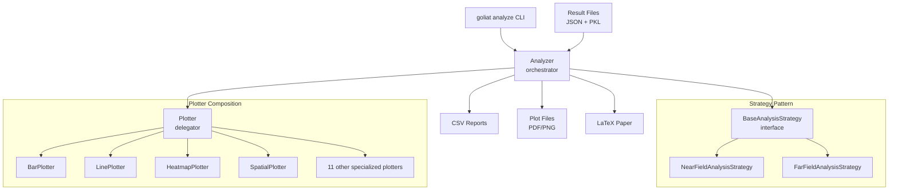

# Analysis system

GOLIAT's analysis system processes simulation results and generates reports, plots, and publications. This document covers user-facing usage and internal architecture.

## User guide

### Running analysis

The analysis command aggregates results from multiple simulations and generates visualizations:

```bash
goliat analyze --config near_field_config
```

**Command options:**

- `--config <config>`: Study configuration file (default: `near_field_config`)
- `--format <pdf|png>`: Plot output format (default: `pdf`)
- `--analysis <path>`: Path to analysis configuration JSON (default: `configs/analysis.json`)
- `--generate-paper`: Generate LaTeX paper after analysis completes

**Example:**

```bash
# Run analysis with PNG output
goliat analyze --config near_field_config --format png

# Run analysis and generate LaTeX paper
goliat analyze --config near_field_config --generate-paper
```

### Analysis configuration

The analysis configuration file (`configs/analysis.json`) controls which plots are generated. Each plot type can be enabled or disabled:

```json
{
  "load_data": true,
  "generate_excel": true,
  "plot_average_sar_bar": true,
  "plot_sar_heatmap": true,
  "plot_pssar_line": false
}
```

**Key settings:**

- `load_data`: If `false`, loads cached results instead of re-processing (faster for re-plotting)
- `generate_excel`: If `true` (default), exports results to a formatted Excel file
- Plot flags: Set to `false` to skip specific plot types

**Available plot types:**

**Near-field plots:**
- `plot_average_sar_bar`: Bar charts of average SAR by frequency
- `plot_average_pssar_bar`: Bar charts of average psSAR10g by frequency
- `plot_sar_line`: Line plots of SAR trends across frequencies
- `plot_pssar_line`: Line plots of psSAR10g trends
- `plot_sar_distribution_boxplots`: Boxplots showing SAR distributions
- `plot_sar_heatmap`: Heatmaps of SAR by tissue and frequency
- `plot_peak_sar_heatmap`: Heatmaps of peak SAR values
- `plot_power_balance_overview`: Power balance visualization
- `plot_peak_location_3d_interactive`: 3D interactive peak location plots
- `plot_peak_location_2d_projections`: 2D projections of peak locations
- `plot_correlation_head_vs_eye_sar`: Correlation scatter plots
- `plot_tissue_group_correlation_matrix`: Correlation heatmaps
- `plot_bubble_mass_vs_sar`: Bubble plots of mass vs SAR
- `plot_top20_tissues_ranking`: Top 20 tissues ranking charts
- `plot_power_efficiency_trends`: Power efficiency line plots
- `plot_penetration_depth_ratio`: Penetration depth analysis
- `plot_tissue_frequency_response`: Frequency response plots
- `plot_cdf`: Cumulative distribution function plots
- `identify_outliers`: Outlier detection and visualization

**Far-field plots:**
- `plot_whole_body_sar_bar`: Whole-body SAR bar charts
- `plot_peak_sar_line`: Peak SAR line plots
- `plot_far_field_distribution_boxplot`: Distribution boxplots

### Output structure

Analysis generates outputs in organized directories:

```
plots/
└── near_field/
    └── <phantom_name>/
        ├── average_sar_bar_*.pdf
        ├── sar_heatmap_*.pdf
        └── ...

results/
└── near_field/
    └── <phantom_name>/
        ├── normalized_results_detailed.csv
        ├── normalized_results_summary.csv
        └── Final_Data_UGent.xlsx
```

**Output files:**

- `Final_Data_UGent.xlsx`: Autosaved Excel file with multiple sheets (Data, Analysis, Specs) containing all results and metadata.
- `normalized_results_detailed.csv`: Per-simulation detailed data with all metrics
- `normalized_results_summary.csv`: Aggregated statistics by frequency and scenario

**Caching:**

Processed results are cached in `results/<study_type>/<phantom>/aggregated_results.pkl`. Set `"load_data": false` in analysis config to skip re-processing and load from cache.

### Paper generation

The `--generate-paper` flag creates a LaTeX document with all plots organized by section:

```bash
goliat analyze --config near_field_config --generate-paper
```

This generates `paper/near_field/pure_results/results.tex` with:
- All plots organized by section and subsection
- Automatic figure numbering and cross-references
- Captions extracted from plot metadata files
- IEEE format document structure

Check out the [auto-generated first draft paper (only results)](https://github.com/rwydaegh/goliat/raw/master/paper/near_field/pure_results/results.pdf) to see an example.

## Developer guide

### Architecture overview

The analysis system uses a strategy pattern to handle different study types:



### Core components

#### Analyzer

The `Analyzer` class orchestrates the analysis pipeline:

1. **Initialization**: Sets up strategy and plotter based on study type
2. **Data loading**: Delegates to strategy to load and process results
3. **Unit conversion**: Normalizes SAR values to standard units (mW/kg)
4. **Caching**: Saves processed data for faster re-plotting
5. **Report export**: Generates CSV files
6. **Plot generation**: Delegates to strategy for plot creation

**Key methods:**

- `run_analysis()`: Main entry point, runs complete pipeline
- `_process_single_result()`: Processes one simulation's result files
- `_convert_units_and_cache()`: Normalizes units and caches results
- `_export_reports()`: Generates CSV output files

#### BaseAnalysisStrategy

Abstract base class defining the analysis interface. Subclasses implement study-specific logic:

**Abstract methods:**

- `load_and_process_results()`: Iterates through results and processes each
- `get_normalization_factor()`: Calculates SAR normalization factor
- `extract_data()`: Extracts structured data from result files
- `apply_bug_fixes()`: Applies study-specific data corrections
- `generate_plots()`: Creates all plots for the study type

**Concrete implementations:**

- `NearFieldAnalysisStrategy`: Handles placement scenarios, positions, orientations
- `FarFieldAnalysisStrategy`: Handles incident directions and polarizations

#### Plotter

The `Plotter` class uses composition to delegate to specialized plot modules:

**Specialized plotters:**

- `BarPlotter`: Bar charts (average SAR, psSAR10g, whole-body SAR)
- `LinePlotter`: Line plots (SAR trends, psSAR10g trends, variations)
- `BoxplotPlotter`: Distribution boxplots
- `HeatmapPlotter`: SAR heatmaps by tissue and frequency
- `SpatialPlotter`: 3D and 2D peak location visualizations
- `CorrelationPlotter`: Correlation scatter plots and matrices
- `BubblePlotter`: Bubble charts (mass vs SAR)
- `RankingPlotter`: Top tissues ranking charts
- `PowerPlotter`: Power efficiency and absorption plots
- `PenetrationPlotter`: Penetration depth analysis
- `TissueAnalysisPlotter`: Tissue frequency response and mass/volume
- `CdfPlotter`: Cumulative distribution functions
- `OutliersPlotter`: Outlier detection and visualization

### Data flow

1. **Result loading**: Strategy iterates through configured scenarios
2. **File discovery**: Locates `sar_results.json` and `sar_stats_all_tissues.pkl` files
3. **Data extraction**: Strategy extracts relevant metrics per simulation
4. **Normalization**: Applies power normalization factors
5. **Aggregation**: Combines all simulations into DataFrames
6. **Unit conversion**: Converts to standard units (mW/kg)
7. **Caching**: Saves processed DataFrames to pickle files
8. **Report generation**: Exports CSV files
9. **Plot generation**: Strategy calls plotter methods with DataFrames

### Adding new plots

To add a new plot type:

1. **Create specialized plotter** (if needed):
   ```python
   # goliat/analysis/plots/my_plot.py
   class MyPlotter(BasePlotter):
       def plot_my_plot(self, results_df, all_organ_results_df):
           # Implementation
   ```

2. **Register in Plotter**:
   ```python
   # goliat/analysis/plotter.py
   self.my_plot = MyPlotter(plots_dir, phantom_name, plot_format)
   def plot_my_plot(self, *args, **kwargs):
       return self.my_plot.plot_my_plot(*args, **kwargs)
   ```

3. **Add to strategy**:
   ```python
   # In generate_plots() method
   if self.should_generate_plot("plot_my_plot"):
       self.plotter.plot_my_plot(results_df, all_organ_results_df)
   ```

4. **Add to analysis config**:
   ```json
   {
     "plot_my_plot": true
   }
   ```

### Data structures

**Main results DataFrame** (`results_df`):
- One row per simulation scenario
- Columns: `frequency_mhz`, `scenario_name`, `position`, `orientation`, SAR metrics, etc.
- Used for aggregated analysis and summary plots

**Organ results DataFrame** (`all_organ_results_df`):
- One row per tissue per simulation
- Columns: `frequency_mhz`, `scenario_name`, `tissue_name`, `tissue_group`, SAR metrics
- Used for tissue-specific analysis and heatmaps

**Tissue groups:**
- Defined in `data/material_name_mapping.json`
- Groups like "eyes", "head", "skin", "genitals" aggregate multiple tissues
- Used for summary statistics and group-level plots

### Normalization

SAR values are normalized to 1W input power:

```python
normalization_factor = target_power_w / simulated_power_w
normalized_sar = raw_sar * normalization_factor
```

**Near-field**: Uses `target_power_mW` from antenna config
**Far-field**: Uses 1.0 (already normalized during simulation)

### Caching mechanism

Processed results are cached to avoid re-processing:

- **Cache location**: `results/<study_type>/<phantom>/aggregated_results.pkl`
- **Cache contents**: Dictionary with `{"summary_results": results_df, "organ_results": all_organ_results_df}`
- **Cache invalidation**: Manual deletion or set `load_data: true`

**Usage:**

```python
# Skip data loading, use cache
analysis_config = {"load_data": False}
strategy = NearFieldAnalysisStrategy(config, phantom_name, analysis_config)
```

### Error handling

The analysis system handles missing files gracefully:

- Missing result files: Logs warning, skips simulation
- Invalid data: Logs error, continues with available data
- Plot generation errors: Logs error, continues with other plots

### Performance considerations

- **Caching**: Use `load_data: false` for re-plotting (10-100x faster)
- **Plot selection**: Disable unused plots in config to save time
- **DataFrame operations**: Uses pandas for efficient data manipulation
- **Plot generation**: Parallel plot generation not implemented (sequential)

### Testing

Analysis components are tested in `tests/test_analysis_*.py`:

- Strategy implementations (`test_analysis_strategies.py`)
- Analyzer class (`test_analysis_analyzer.py`)
- Base strategy interface (`test_analysis_base_strategy.py`)
- CLI integration (`test_cli_run_analysis.py`)

Run tests:

```bash
pytest tests/test_analysis_*.py
```

