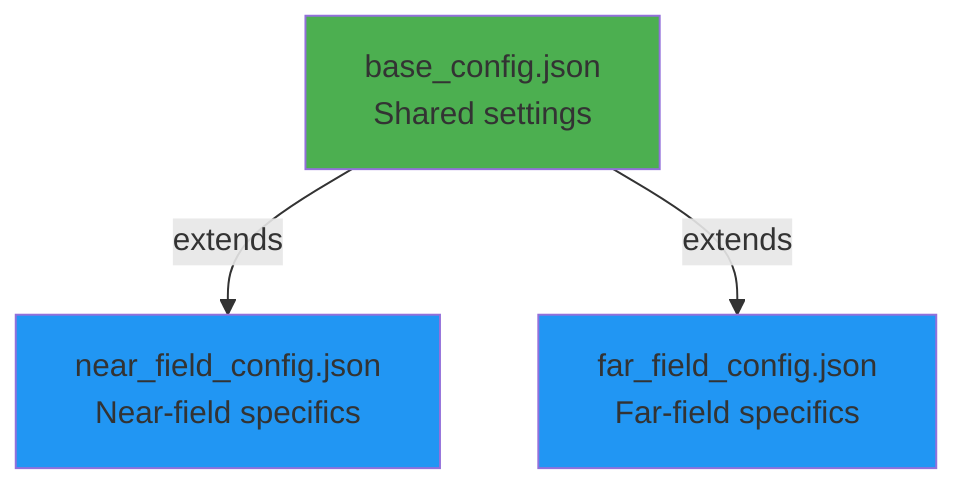

# GOLIAT Configuration Guide

GOLIAT uses a hierarchical JSON configuration system to define all aspects of a simulation study. This modular approach allows for flexibility and reproducibility. A study-specific configuration file (e.g., `near_field_config.json`) inherits settings from a `base_config.json` file, allowing you to override only the parameters you need for a specific study.

This guide provides a reference for all available configuration parameters, their purpose, and valid values.

## Configuration hierarchy

The system is designed to avoid repetition by allowing configurations to "extend" a base file. The child's values will always override the parent's.



To create a custom study, you can copy an existing configuration and modify it. For example, to create `my_study.json`:

```json
{
  "extends": "near_field_config.json",
  "phantoms": ["thelonious"],
  "frequencies_mhz": [900]
}
```

---

## **1. Core Settings** (`base_config.json`)

These are the foundational settings shared across all study types.

| Parameter | Type | Example Value | Description |
| :--- | :--- | :--- | :--- |
| `extends` | string | `"base_config.json"` | **(Optional)** Specifies the parent configuration file to inherit from. This is typically used in study-specific configs. |
| `study_type` | string | `"near_field"` | **(Required)** The type of study to run. Valid options are `"near_field"` or `"far_field"`. |
| `use_gui` | boolean | `true` | If `true`, the graphical user interface (GUI) will be launched to monitor progress. If `false`, the study runs in headless mode, printing logs to the console. |
| `phantoms` | array | `["thelonious", "eartha"]` | A list of the virtual human phantom models to be used in the study. For near-field studies, you can also include `"freespace"` to run a simulation of the antenna in isolation. |
| `verbose` | boolean | `false` | If `true`, enables detailed verbose logging to the console, in addition to the standard progress logs. |

<br>

## **2. Execution Control** (`execution_control`)

This object controls which phases of the workflow are executed. This is useful for re-running specific parts of a study, such as only extracting results from an already completed simulation.

| Parameter | Type | Default | Description |
| :--- | :--- | :--- | :--- |
| `do_setup` | boolean | `true` | If `true`, the simulation scene will be built (phantoms loaded, materials assigned, etc.). |
| `do_run` | boolean | `true` | If `true`, the simulation solver will be executed. |
| `do_extract` | boolean | `true` | If `true`, the results will be extracted from the simulation output and processed. |
| `only_write_input_file` | boolean | `false` | If `true`, the `run` phase will only generate the solver input file (`.h5`) and then stop, without actually running the simulation. This is useful for debugging the setup or for preparing files for a manual cloud submission. **Note**: This flag modifies the behavior of the run phase, so `do_run` must be `true` for this to have any effect. |
| `batch_run` | boolean | `false` | If `true`, enables the oSPARC batch submission workflow. This is an advanced feature for running many simulations in parallel on the cloud. |
| `auto_cleanup_previous_results` | array | `[]` | A list of file types to automatically delete **after** a simulation's results have been successfully extracted. This helps to preserve disk space in serial workflows. Valid values are: `"output"` (`*_Output.h5`), `"input"` (`*_Input.h5`), and `"smash"` (`*.smash`). **Warning**: This feature is incompatible with parallel or batch runs and should only be used when `do_setup`, `do_run`, and `do_extract` are all `true`. |

The `do_setup` flag directly controls the project file (`.smash`) handling. Its behavior is summarized below:

| `do_setup` Value | File Exists? | Action |
| :--- | :--- | :--- |
| `true` | Yes | **Delete and Override** with a new project. |
| `true` | No | Create a new project. |
| `false` | Yes | **Open and Use** the existing project. |
| `false` | No | **Error** and terminate the program. |

**Example: Write input file without running solver**
```json
"execution_control": {
  "do_setup": true,
  "do_run": true,
  "do_extract": false,
  "only_write_input_file": true
}
```

!!! warning "Common mistake"
    Setting `only_write_input_file: true` with `do_run: false` will skip the run phase entirely. The flag only affects the *behavior* of the run phase, not whether it executes. You must set `do_run: true` for the input file to be written.

**Example: Extraction-only workflow**
```json
"execution_control": {
  "do_setup": false,
  "do_run": false,
  "do_extract": true
}
```

**Example: Aggressive Cleanup in a Serial Workflow**
```json
"execution_control": {
  "do_setup": true,
  "do_run": true,
  "do_extract": true,
  "auto_cleanup_previous_results": ["output", "input"]
}
```

<br>

## **3. Simulation Parameters** (`simulation_parameters`)

These settings control the core behavior of the FDTD solver.

| Parameter | Type | Example Value | Description |
| :--- | :--- | :--- | :--- |
| `global_auto_termination` | string | `"GlobalAutoTerminationUserDefined"` | The solver's termination criteria. `"GlobalAutoTerminationWeak"` is a common default, while `"GlobalAutoTerminationUserDefined"` allows for a custom convergence level. |
| `convergence_level_dB` | number | `-15` | The convergence threshold in decibels (dB) when using user-defined termination. The simulation stops when the energy in the system decays below this level. |
| `simulation_time_multiplier` | number | `3.5` | A multiplier used to determine the total simulation time. The time is calculated as the duration it takes for a wave to traverse the simulation bounding box diagonal, multiplied by this value. |
| `number_of_point_sensors` | number | `8` | The number of point sensors to place at the corners of the simulation bounding box. These sensors monitor the electric field over time. |
| `point_source_order` | array | `["lower_left_bottom", ...]` | Defines the specific order and location of the point sensors at the 8 corners of the bounding box. |
| `excitation_type` | string | `"Harmonic"` | The type of excitation source. `"Harmonic"` is used for single-frequency simulations (standard for SAR). `"Gaussian"` is used for a frequency sweep, typically for antenna characterization in free-space. |
| `bandwidth_mhz` | number | `50.0` | The bandwidth in MHz for a Gaussian excitation. |
| `bbox_padding_mm` | number | `50` | **(Far-Field)** Padding in millimeters to add around the phantom's bounding box to define the simulation domain. |
| `freespace_antenna_bbox_expansion_mm` | array | `[20, 20, 20]` | **(Near-Field)** Padding in [x, y, z] millimeters to add around the antenna for free-space simulations. |

<br>

## **4. Gridding Parameters** (`gridding_parameters`)

These settings define the spatial discretization of the simulation domain.

| Parameter | Type | Example Value | Description |
| :--- | :--- | :--- | :--- |
| `global_gridding.grid_mode` | string | `"automatic"` | The global gridding strategy. Can be `"automatic"` or `"manual"`. |
| `global_gridding.refinement` | string | `"AutoRefinementDefault"` | For automatic gridding, this sets the refinement level. Options: `"VeryFine"`, `"Fine"`, `"Default"`, `"Coarse"`, `"VeryCoarse"`. |
| `global_gridding.manual_fallback_max_step_mm` | number | `3.0` | For manual gridding, this is the maximum grid step size in millimeters used as a fallback. **Note**: GOLIAT enforces a hard limit of 3.0 mm for manual grids. Values larger than 3.0 mm will cause an error. See [Troubleshooting](../troubleshooting.md#manual-grid-size-exceeds-3-mm-limit) for details. |
| `global_gridding_per_frequency` | object | `{"700": 3.0}` | **(Far-Field)** A mapping of frequency (in MHz) to a specific manual grid step size in millimeters. This allows for finer grids at higher frequencies. **Note**: All values must be ≤ 3.0 mm (GOLIAT enforces a hard limit). |
| `padding.padding_mode` | string | `"automatic"` | Defines how padding is applied around the simulation domain. Can be `"automatic"` or `"manual"`. |
| `padding.manual_bottom_padding_mm` | array | `[0, 0, 0]` | For manual padding, the [x, y, z] padding in millimeters at the bottom of the domain. |
| `padding.manual_top_padding_mm` | array | `[0, 0, 0]` | For manual padding, the [x, y, z] padding in millimeters at the top of the domain. |

<br>

## **5. Solver and Miscellaneous Settings**

| Parameter | Type | Example Value | Description |
| :--- | :--- | :--- | :--- |
| `solver_settings.kernel` | string | `"Acceleware"` | The solver kernel to use. `"Software"` (CPU), `"Acceleware"` (GPU, required for near-field due to SIBC support), or `"CUDA"` (GPU). |
| `solver_settings.boundary_conditions.type` | string | `"UpmlCpml"` | The type of Perfectly Matched Layer (PML) boundary conditions. |
| `solver_settings.boundary_conditions.strength` | string | `"Medium"` | The strength of the PML boundary conditions. Options: `"Weak"`, `"Medium"`, `"Strong"`. |
| `manual_isolve` | boolean | `true` | If `true`, runs the `iSolve.exe` solver directly. This is the recommended setting to avoid a known bug with the Ares scheduler. |
| `save_retry_count` | number | `4` | The number of times to retry saving a project file if Sim4Life randomly errors out. Each retry attempt logs a warning. If all attempts fail, the error is raised. |
| `export_material_properties` | boolean | `false` | **(Advanced)** If `true`, the framework will extract and save material properties from the simulation to a `.pkl` file. |
| `line_profiling` | object | See below | **(Advanced)** Enables detailed line-by-line code profiling for specific functions to debug performance. |

**Example: Line Profiling**
```json
"line_profiling": {
  "enabled": true,
  "subtasks": {
    "setup_simulation": ["goliat.setups.base_setup.BaseSetup._finalize_setup"]
  }
}
```

---

## **6. Far-Field Specifics** (`far_field_config.json`)

These settings are unique to far-field (environmental exposure) studies.

| Parameter | Type | Example Value | Description |
| :--- | :--- | :--- | :--- |
| `frequencies_mhz` | array | `[450, 700, 900]` | An array of frequencies in MHz to simulate. Each frequency will generate a separate `.smash` project file containing simulations for all directions and polarizations. |
| `far_field_setup.type` | string | `"environmental"` | The far-field scenario type. Currently, only `"environmental"` (plane waves) is fully implemented. |
| `far_field_setup.environmental.incident_directions` | array | `["x_pos", "y_neg"]` | A list of plane wave incident directions. Supported values are single-axis directions: `"x_pos"`, `"x_neg"`, `"y_pos"`, `"y_neg"`, `"z_pos"`, `"z_neg"`. |
| `far_field_setup.environmental.polarizations` | array | `["theta", "phi"]` | A list of polarizations to simulate for each incident direction. `"theta"` corresponds to vertical polarization and `"phi"` to horizontal. |

<br>

## **7. Near-Field Specifics** (`near_field_config.json`)

These settings are unique to near-field (device exposure) studies.

### Antenna configuration (`antenna_config`)
This object defines all antenna-specific information, with a separate entry for each frequency.

| Parameter | Type | Example Value | Description |
| :--- | :--- | :--- | :--- |
| `antenna_config.{freq}.model_type` | string | `"PIFA"` | The type of antenna model, used to select specific setup logic. Options: `"PIFA"`, `"IFA"`. |
| `antenna_config.{freq}.source_name` | string | `"Lines 1"` | The name of the source entity within the antenna's CAD model. |
| `antenna_config.{freq}.materials` | object | `{ "Extrude 1": "Copper", ...}` | Maps component names in the antenna's CAD model to Sim4Life material names. |
| `antenna_config.{freq}.gridding` | object | `{ "automatic": [...], "manual": {...} }` | Defines gridding strategies (automatic or manual with specific step sizes) for different parts of the antenna model. |
| `antenna_config.{freq}.gridding.subgridding` | object | `{ "components": [...], ...}` | **(Optional)** Enables subgridding for a list of components, which overrides any manual gridding settings for those components. This is useful for finely detailed parts that require a much higher resolution than the rest of the model. See below for subgridding configuration details. |

### Placement scenarios (`placement_scenarios`)
This object defines the different device placements to be simulated.

| Parameter | Type | Example Value | Description |
| :--- | :--- | :--- | :--- |
| `placement_scenarios.{name}.positions` | object | `{ "center": [0,0,0], ...}` | A set of named relative positions (as [x, y, z] offsets) for the placement scenario. |
| `placement_scenarios.{name}.orientations` | object | `{ "vertical": [], ...}` | A set of named orientations to be applied at each position. Each orientation is a list of rotation steps. See below for an alternative dictionary format for `by_cheek` phantom rotation. |
| `placement_scenarios.{name}.bounding_box` | string | `"default"` | Determines which part of the phantom to include in the simulation bounding box. Options: `"default"`, `"head"`, `"trunk"`, `"whole_body"`. The `"default"` option intelligently chooses "head" for eye/cheek placements and "trunk" for belly placements. |
| `placement_scenarios.{name}.phantom_reference` | string | `"tragus"` | **(Optional)** Specifies an anatomical reference point used for placement calculations. The reference point coordinates are defined in `phantom_definitions.{phantom_name}`. Common values: `"nasion"` (for `front_of_eyes`), `"tragus"` (for `by_cheek`), `"belly_button"` (for `by_belly`). If not specified, the default placement center is used. |
| `placement_scenarios.{name}.antenna_reference` | object | `{ "distance_from_top": 10 }` | **(Optional)** Defines antenna positioning relative to a reference point on the antenna model. |

<br>

**Alternative orientation format for `by_cheek` phantom rotation**

For the `by_cheek` scenario, an alternative dictionary format can be used to enable automatic phantom rotation towards the phone. This is useful for precise placement based on contact.

```json
"orientations": {
  "cheek_base": {
    "rotate_phantom_to_cheek": true,
    "angle_offset_deg": 0
  }
}
```

- **`rotate_phantom_to_cheek`**: (boolean) If `true`, the phantom rotates on its Z-axis to touch the phone.
- **`angle_offset_deg`**: (number) An additional angle in degrees to rotate the phantom away from the phone after contact is detected.

**Subgridding configuration**

Subgridding allows specific antenna components to use a finer grid resolution than the global grid. This is configured in the `antenna_config.{freq}.gridding.subgridding` object:

```json
{
  "antenna_config": {
    "700": {
      "gridding": {
        "subgridding": {
          "components": ["component1:Battery", "component1:Patch", "Extrude 1", "component1:ShortingPin"],
          "SubGridMode": "Box",
          "SubGridLevel": "x9",
          "AutoRefinement": "AutoRefinementVeryFine"
        }
      }
    }
  }
}
```

- **`components`**: (array of strings) List of component names to apply subgridding to. These components will use the subgrid resolution instead of the global or manual grid settings.
- **`SubGridMode`**: (string) The subgrid mode, typically `"Box"`.
- **`SubGridLevel`**: (string) The subgrid level multiplier relative to the global grid. Common values: `"x9"` (9x finer), `"x3"` (3x finer). Higher values provide finer resolution but increase computation time.
- **`AutoRefinement`**: (string) The refinement level for subgridded components. Options: `"AutoRefinementVeryFine"`, `"AutoRefinementFine"`, `"AutoRefinementDefault"`.

Subgridding overrides any manual gridding settings for the specified components. Components not listed in the `components` array use the global gridding strategy (automatic or manual) as configured.

### Phantom definitions (`phantom_definitions`)
This object contains phantom-specific settings, such as which placements to run and the separation distances.

| Parameter | Type | Example Value | Description |
| :--- | :--- | :--- | :--- |
| `phantom_definitions.{name}.placements` | object | `{ "do_by_cheek": true, ...}` | A set of booleans to enable or disable specific placement scenarios for a given phantom. The key must match a scenario name from `placement_scenarios`. |
| `phantom_definitions.{name}.distance_from_cheek` | number | `8` | The separation distance in millimeters for the "by_cheek" placement. |
| `phantom_definitions.{name}.distance_from_eye` | number | `200` | The separation distance in millimeters for the "front_of_eyes" placement. |
| `phantom_definitions.{name}.distance_from_belly` | number | `100` | The separation distance in millimeters for the "by_belly" placement. |
| `phantom_definitions.{name}.lips` | array | `[0, 122, 31]` | The [x, y, z] coordinates of the center of the lips, used for the 'cheek' placement calculation. |
| `phantom_definitions.{name}.nasion` | array | `[-1, 0, 0]` | **(Optional)** Relative [x, y, z] offset coordinates for the nasion landmark, used as a reference point for `front_of_eyes` placement when `phantom_reference: "nasion"` is specified. These coordinates are offsets from the geometrically calculated eye center (derived from eye entity bounding boxes). The coordinate system: X (inside head to right ear out), Y (out of face), Z (up head and out). |
| `phantom_definitions.{name}.tragus` | array | `[0, 7, -5]` | **(Optional)** Relative [x, y, z] offset coordinates for the tragus landmark, used as a reference point for `by_cheek` placement when `phantom_reference: "tragus"` is specified. These coordinates are offsets from the geometrically calculated ear center (derived from Ear_skin entity bounding box). The coordinate system: X (inside head to right ear out), Y (out of face), Z (up head and out). |
| `phantom_definitions.{name}.belly_button` | array | `[-5, 0, -140]` | **(Optional)** Relative [x, y, z] offset coordinates for the belly button landmark, used as a reference point for `by_belly` placement when `phantom_reference: "belly_button"` is specified. These coordinates are offsets from the geometrically calculated trunk center (derived from trunk bounding box). The coordinate system: X (inside head to right ear out), Y (out of face), Z (up head and out). |

**How reference point coordinates are derived:**

The reference point coordinates (nasion, tragus, belly_button) are relative offsets, not absolute positions. They are calculated as offsets from geometrically derived centers:

- **`nasion`**: Offset from the center of the eye bounding box (calculated from Eye/Cornea entities)
- **`tragus`**: Offset from the center of the ear bounding box (calculated from Ear_skin entity)
- **`belly_button`**: Offset from the center of the trunk bounding box (calculated from Trunk_BBox entity)

These offsets are determined through anatomical landmark identification techniques and are added to the calculated geometric centers during placement. The coordinate system is consistent across all phantoms: X-axis extends from inside the head toward the right ear, Y-axis extends outward from the face, and Z-axis extends upward along the head.

---

## **8. Credentials and Data**

For security and portability, certain information is handled outside the main configuration files.

### oSPARC Credentials
oSPARC API credentials should be stored in a `.env` file in the project root directory.

```
# .env file
OSPARC_API_KEY=your_osparc_api_key
OSPARC_API_SECRET=your_osparc_api_secret
```

### Phantom downloads
Some phantom models require an email address for download, which can also be set in the `.env` file. This should be the email associated with your institution's Sim4Life license.

```
# .env file
DOWNLOAD_EMAIL=your_email@example.com
```

---

## **9. Accessing Configuration in Code**

The `Config` class supports dictionary-style access with dot-notation for nested paths:

```python
# Simple top-level access
sim_params = config["simulation_parameters"] or {}
antenna_config = config["antenna_config"] or {}

# Nested path access
excitation_type = config["simulation_parameters.excitation_type"] or "Harmonic"
gridding_params = config["gridding_parameters"] or {}

# With fallback values
expansion = config["simulation_parameters.freespace_antenna_bbox_expansion_mm"] or [10, 10, 10]
```

**Note**: The `or` operator provides a fallback when a key doesn't exist (returns `None`). This is the standard pythonic pattern.

### Accessing Complex Structures

For accessing nested dictionaries within config values:

```python
# Get a top-level dict, then access nested keys
placement_scenarios = config["placement_scenarios"] or {}
scenario = placement_scenarios.get("by_cheek") if isinstance(placement_scenarios, dict) else None

# Or use dot notation directly
scenario = config["placement_scenarios.by_cheek"]
```

---

This structure makes every aspect of a GOLIAT simulation controllable, reproducible, and easy to manage. For more workflow-oriented information, please see the [User Guide](../user_guide/user_guide.md). For a complete list of all GOLIAT features, see the [Full List of Features](../reference/full_features_list.md).