# System architecture

This document provides a comprehensive overview of the GOLIAT system architecture, showing all major components and their relationships.

## Architecture diagram

The diagram below is interactive: hold Alt (or Option on Mac) and use your mouse wheel to zoom in/out, or hold Alt and drag to pan around.

```mermaid
graph TB
    subgraph "Entry points"
        CLI[CLI Commands<br/>study, analyze, parallel<br/>worker, super_study]
    end
    
    subgraph "Main process"
        subgraph "GUI layer"
            ProgressGUI[ProgressGUI<br/>PySide6]
            QueueHandler[QueueHandler<br/>processes messages]
            WebBridgeMgr[WebBridgeManager<br/>connection lifecycle]
        end
        
        subgraph "GUI components"
            StatusMgr[StatusManager<br/>log display]
            ProgressMgr[ProgressManager<br/>progress bars]
            DataMgr[DataManager<br/>CSV tracking]
            GraphMgr[GraphManager<br/>plot updates]
            UtilMgr[UtilizationManager<br/>system metrics]
            SystemMon[SystemMonitor<br/>CPU/RAM/GPU]
            Plots[Plots<br/>matplotlib]
            Timings[TimingsTable<br/>execution stats]
            PieCharts[PieChartsManager<br/>time breakdown]
            TrayMgr[TrayManager<br/>system tray]
        end
        
        subgraph "Web monitoring"
            WebBridge[WebGUIBridge<br/>message forwarding]
            HTTPClient[HTTPClient<br/>API requests]
            MsgSanitizer[MessageSanitizer<br/>serialization]
        end
    end
    
    subgraph "Study process"
        subgraph "Orchestration"
            BaseStudy[BaseStudy<br/>common logic]
            NearFieldStudy[NearFieldStudy]
            FarFieldStudy[FarFieldStudy]
            Config[Config<br/>hierarchical JSON]
            Profiler[Profiler<br/>timing & ETA]
        end
        
        subgraph "Core processing"
            ProjectMgr[ProjectManager<br/>.smash files]
            Setup[NearFieldSetup<br/>FarFieldSetup]
            SetupModules[Setup Modules<br/>Phantom, Placement<br/>Material, Gridding<br/>Boundary, Source]
            SimRunner[SimulationRunner<br/>iSolve / oSPARC]
            ResultsExt[ResultsExtractor<br/>SAR extraction]
            Extractors[Extractor Modules<br/>Power, SAR, Sensor<br/>Reporter, Cleaner]
        end
        
        subgraph "Analysis"
            Analyzer[Analyzer<br/>strategy pattern]
            NearStrategy[NearFieldStrategy]
            FarStrategy[FarFieldStrategy]
            Plotter[Plotter<br/>visualization]
        end
        
        QueueGUI[QueueGUI<br/>proxy interface]
    end
    
    subgraph "Worker system"
        SuperStudy[Super Study<br/>config splitting]
        WorkerCLI[Worker CLI<br/>assignment fetch]
        Assignment[Assignment<br/>claim & run]
    end
    
    subgraph "Cloud execution"
        oSPARCBatch[oSPARC Batch<br/>job submission]
        oSPARCClient[oSPARC Client<br/>API wrapper]
        oSPARCWorker[oSPARC Worker<br/>job monitoring]
    end
    
    subgraph "External services"
        S4L[Sim4Life Engine<br/>iSolve.exe]
        oSPARC[oSPARC Platform<br/>cloud compute]
        Dashboard[Monitoring Dashboard<br/>PostgreSQL + Next.js]
    end
    
    subgraph "Communication"
        Queue[multiprocessing.Queue<br/>GUI messages]
        InternalQueue[Internal Queue<br/>web bridge]
    end
    
    %% Entry point flows
    CLI -->|study| ProgressGUI
    CLI -->|analyze| Analyzer
    CLI -->|parallel| ProgressGUI
    CLI -->|worker| WorkerCLI
    CLI -->|super_study| SuperStudy
    
    %% Main process flows
    ProgressGUI --> QueueHandler
    QueueHandler --> StatusMgr
    QueueHandler --> ProgressMgr
    QueueHandler --> DataMgr
    QueueHandler --> GraphMgr
    QueueHandler --> UtilMgr
    QueueHandler --> WebBridgeMgr
    
    ProgressMgr --> ProgressGUI
    GraphMgr --> Plots
    UtilMgr --> SystemMon
    DataMgr --> GraphMgr
    
    WebBridgeMgr --> WebBridge
    WebBridge --> InternalQueue
    WebBridge --> HTTPClient
    HTTPClient --> MsgSanitizer
    HTTPClient -->|POST| Dashboard
    
    %% Study process flows
    ProgressGUI -->|spawns| QueueGUI
    QueueGUI --> Queue
    Queue --> QueueHandler
    
    QueueGUI --> BaseStudy
    BaseStudy --> Config
    BaseStudy --> Profiler
    BaseStudy --> ProjectMgr
    
    BaseStudy --> NearFieldStudy
    BaseStudy --> FarFieldStudy
    
    NearFieldStudy --> Setup
    FarFieldStudy --> Setup
    Setup --> SetupModules
    Setup --> ProjectMgr
    Setup --> S4L
    
    NearFieldStudy --> SimRunner
    FarFieldStudy --> SimRunner
    SimRunner --> S4L
    SimRunner -->|batch mode| oSPARCBatch
    oSPARCBatch --> oSPARCClient
    oSPARCClient --> oSPARC
    
    NearFieldStudy --> ResultsExt
    FarFieldStudy --> ResultsExt
    ResultsExt --> Extractors
    ResultsExt --> S4L
    
    ResultsExt --> Analyzer
    Analyzer --> NearStrategy
    Analyzer --> FarStrategy
    Analyzer --> Plotter
    
    %% Worker system flows
    SuperStudy -->|uploads| Dashboard
    WorkerCLI -->|fetches| Dashboard
    WorkerCLI --> Assignment
    Assignment -->|runs| BaseStudy
    Assignment -->|reports| Dashboard
    
    %% Styling
    style ProgressGUI fill:#E1BEE7
    style WebBridge fill:#BBDEFB
    style BaseStudy fill:#BBDEFB
    style NearFieldStudy fill:#BBDEFB
    style FarFieldStudy fill:#BBDEFB
    style Setup fill:#C5E1A5
    style SimRunner fill:#FFE082
    style ResultsExt fill:#FFCCBC
    style Analyzer fill:#D1C4E9
    style Plotter fill:#D1C4E9
    style Dashboard fill:#E1BEE7
    style Queue fill:#FFE082
    style S4L fill:#FFCCBC
    style oSPARC fill:#FFCCBC
```

## Component descriptions

### Entry points

- **CLI Commands**: Main entry points (`goliat study`, `goliat analyze`, `goliat parallel`, `goliat worker`, `goliat super_study`)

### Main process (GUI)

- **ProgressGUI**: Main PySide6 window, manages all GUI components
- **QueueHandler**: Polls multiprocessing queue (every 100ms), dispatches messages to GUI components and web bridge
- **WebBridgeManager**: Manages web bridge lifecycle, collects system info, handles connection status

GUI Components:

- **StatusManager**: Color-coded log display
- **ProgressManager**: Overall and stage progress bars
- **DataManager**: CSV file management for time series data
- **GraphManager**: Coordinates plot updates
- **UtilizationManager**: System resource monitoring (CPU, RAM, GPU)
- **SystemMonitor**: Low-level system metrics via psutil and nvidia-smi
- **Plots**: Matplotlib-based visualizations (time remaining, progress, utilization)
- **TimingsTable**: Execution statistics display
- **PieChartsManager**: Time breakdown visualization
- **TrayManager**: System tray integration

Web Monitoring:

- **WebGUIBridge**: Forwards GUI messages to dashboard API, throttles and batches
- **HTTPClient**: HTTP request handling for `/api/gui-update` and `/api/heartbeat`
- **MessageSanitizer**: Serializes non-serializable objects before sending

### Study process

Orchestration:

- **BaseStudy**: Common study logic, phase management, error handling
- **NearFieldStudy**: Near-field simulation orchestration
- **FarFieldStudy**: Far-field simulation orchestration
- **Config**: Hierarchical JSON configuration with inheritance
- **Profiler**: Timing tracking, ETA estimation, weighted progress

Core Processing:

- **ProjectManager**: Sim4Life `.smash` file lifecycle, verification, metadata
- **Setup**: Coordinates scene building (NearFieldSetup or FarFieldSetup)
- **Setup Modules**: Specialized setup tasks (PhantomSetup, PlacementSetup, MaterialSetup, GriddingSetup, BoundarySetup, SourceSetup)
- **SimulationRunner**: Executes simulations via iSolve.exe or oSPARC
- **ResultsExtractor**: Orchestrates result extraction
- **Extractor Modules**: Specialized extraction (PowerExtractor, SarExtractor, SensorExtractor, Reporter, Cleaner)

Analysis:

- **Analyzer**: Strategy-based analysis orchestration
- **NearFieldStrategy**: Near-field specific analysis logic
- **FarFieldStrategy**: Far-field specific analysis logic
- **Plotter**: Generates plots and visualizations

Communication:

- **QueueGUI**: Proxy interface that mimics GUI but sends to multiprocessing queue

### Worker system

- **Super Study**: Splits config into assignments, uploads to dashboard
- **Worker CLI**: Fetches assignments from dashboard, claims them, runs studies
- **Assignment**: Individual config slice executed by a worker

### Cloud execution

- **oSPARC Batch**: Manages batch job submission and monitoring
- **oSPARC Client**: Wraps oSPARC API for job submission
- **oSPARC Worker**: Monitors job status, downloads results

### External services

- **Sim4Life Engine**: FDTD solver (`iSolve.exe`), scene building API
- **oSPARC Platform**: Cloud compute platform for parallel execution
- **Monitoring Dashboard**: Web-based monitoring (PostgreSQL database, Next.js frontend)

### Communication channels

- **multiprocessing.Queue**: Inter-process communication between GUI and study process
- **Internal Queue**: WebGUIBridge internal queue for message throttling

## Data flow

1. **User starts study**: CLI command → ProgressGUI spawns study process
2. **Study process**: QueueGUI → multiprocessing.Queue → QueueHandler → GUI components
3. **Web monitoring**: QueueHandler → WebGUIBridge → HTTPClient → Dashboard API
4. **Worker mode**: Worker CLI → Dashboard API → Assignment → Study process
5. **Cloud execution**: SimulationRunner → oSPARC Batch → oSPARC Platform

## Key design patterns

- **Multiprocessing**: GUI and study run in separate processes for responsiveness
- **Queue-based communication**: Decoupled message passing between processes
- **Strategy pattern**: Analysis strategies (near-field vs far-field)
- **Bridge pattern**: WebGUIBridge forwards messages without coupling
- **Modular components**: GUI and setup use modular, replaceable components
- **Configuration-driven**: JSON configs drive simulation parameters
