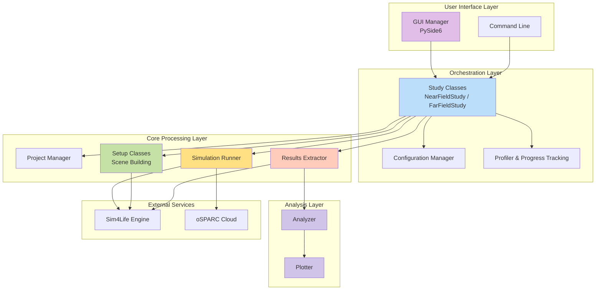
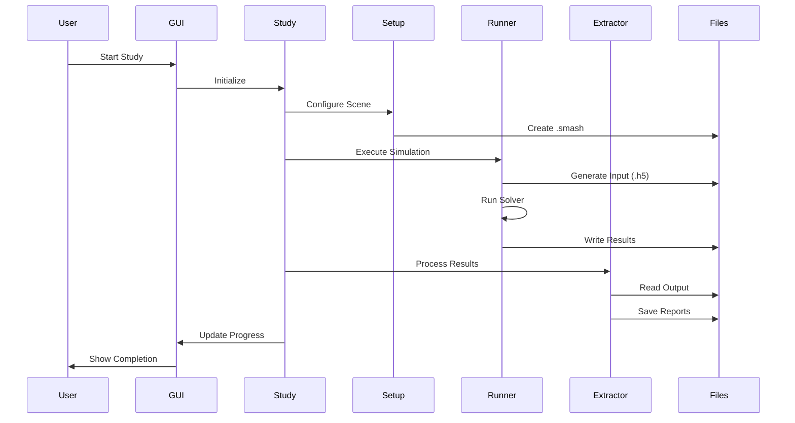

# GOLIAT technical guide

This document provides an overview of the GOLIAT project's architecture, key components, and core functionalities. It is intended for developers who want to understand, extend, or maintain the codebase.

## Core philosophy

GOLIAT is designed with a modular, configuration-driven architecture. The primary goal is to automate the entire EMF dosimetry simulation workflow—scene setup, execution, and results analysis—while maintaining reproducibility and scalability. The system is orchestrated by **Study** classes, which manage the simulation lifecycle based on parameters defined in JSON configuration files. This approach allows for easy modification of simulation parameters without changing the underlying code, and it allows simulations to be repeated with the exact same settings.

## System architecture

The application is structured in several distinct layers, each with a specific responsibility. This separation of concerns makes the system easier to understand, maintain, and extend.



## Workflow and component interactions

The simulation process follows a clear, sequential workflow, orchestrated by the `NearFieldStudy` or `FarFieldStudy` classes. This workflow completes each step successfully before the next one begins, and it provides a clear structure for the entire simulation process.



## Core components

This section details GOLIAT's core classes and their roles within the framework. For a complete API reference, please see the [Full API Reference](../reference/api_reference.md).

### Orchestration layer

#### `Config`
- **Function**: Loads and manages hierarchical JSON configurations. A study-specific config (e.g., `near_field_config.json`) extends a `base_config.json`, allowing for a clean override system. This design minimizes duplication and makes it easy to manage different simulation scenarios. The `Config` class is responsible for loading the `base_config.json` and then recursively merging the study-specific configuration over it.
- **Some interesting methods**:

    - `__getitem__(path)`: Dictionary-style access with dot-notation support. Returns `None` if key doesn't exist, enabling pythonic fallback patterns: `config["simulation_parameters"] or {}`
    - `get_material_mapping(phantom_name)`: Returns material name mapping for a specific phantom.
    - `get_profiling_config(study_type)`: Returns profiling configuration for a study type.
    - `_load_config_with_inheritance(path)`: The core method that handles the hierarchical loading of configuration files.

**Access Pattern**: The Config class uses dictionary-style access with fallback:
- `config["simulation_parameters.excitation_type"] or "Harmonic"` (pythonic fallback pattern)

**⚠️ Important**: When using the `or` pattern for default values, be careful about falsy values:

- **Safe**: If the default is falsy (`False`, `0`, `[]`, `{}`, `""`), the `or` pattern is safe because falsy values won't be masked:
  - `config["key"] or False` - `False` stays `False`
  - `config["key"] or 0` - `0` stays `0`
  - `config["key"] or []` - Empty list stays empty

- **Problematic**: If the default is truthy (`True`, non-zero numbers, non-empty strings/lists), use explicit `None` checks to avoid masking falsy values:
  - ❌ `config["use_gui"] or True` - `False` becomes `True` (wrong!)
  - ✅ `use_gui = config["use_gui"]; if use_gui is None: use_gui = True` - `False` stays `False`
  - ❌ `config["bbox_padding_mm"] or 50` - `0` becomes `50` (wrong if `0` is valid!)
  - ✅ `padding = config["bbox_padding_mm"]; if padding is None: padding = 50` - `0` stays `0`

**Rule of thumb**: If the default is falsy, the `or` pattern is safe. If the default is truthy, use explicit `None` checks to avoid masking falsy values.

- **API Reference**: [goliat.config.Config](../reference/api_reference.md#goliat.config.Config)

#### Tissue Grouping

GOLIAT groups individual tissues into logical categories (e.g., eyes, brain, skin) for aggregated SAR analysis. The grouping process occurs during SAR extraction and uses explicit mappings defined in `material_name_mapping.json`.

**How it works:**

1. **Tissue Name Extraction**: Sim4Life returns tissue names that may include phantom suffixes (e.g., `"Cornea  (Thelonious_6y_V6)"`). These original names are preserved in the SAR DataFrame without cleaning or normalization.

2. **Matching Process**: The `TissueGrouper` class matches tissues to groups by:
   - Stripping phantom suffixes (e.g., `"Cornea  (Thelonious_6y_V6)"` → `"Cornea"`)
   - Checking if the cleaned name matches an entity name directly in `material_name_mapping.json`
   - If not found, checking if it matches a material name (using a reverse lookup)
   - Once the entity is identified, checking which group(s) it belongs to in `_tissue_groups`

3. **Configuration**: Tissue groups are defined per phantom in `material_name_mapping.json` under the `_tissue_groups` key:
   ```json
   {
     "thelonious": {
       "_tissue_groups": {
         "eyes_group": ["Cornea", "Eye_lens", "Eye_Sclera", "Eye_vitreous_humor"],
         "brain_group": ["Brain_grey_matter", "Brain_white_matter", ...],
         ...
       },
       "Cornea": "Eye (Cornea)",
       "Eye_lens": "Eye (Lens)",
       ...
     }
   }
   ```

4. **Output**: The grouping returns a dictionary mapping group names to lists of matched tissue names (with original phantom suffixes preserved). This ensures consistency between the DataFrame and the grouping results.

**Note**: Far-field analysis uses keyword-based substring matching for plotting (defined in `Analyzer.tissue_group_definitions`), which is separate from the extraction-phase grouping. This works because tissue names in pickle files contain the keywords (e.g., `"Cornea"` matches `"Cornea  (Thelonious_6y_V6)"` via substring search).

- **API Reference**: [goliat.extraction.tissue_grouping.TissueGrouper](../reference/api_reference.md#goliat.extraction.tissue_grouping.TissueGrouper)

#### `BaseStudy`, `NearFieldStudy`, `FarFieldStudy`
- **Function**: Orchestrates the entire simulation workflow. `BaseStudy` provides the core structure, including the main `run()` method, logging, and profiling. `NearFieldStudy` and `FarFieldStudy` inherit from `BaseStudy` and implement the `_run_study()` method, which contains the specific logic for each study type. This inheritance-based design allows for code reuse and a clear separation of concerns.
- **Some interesting methods**:

    - `run()`: The main entry point to execute the study. It handles top-level error handling and checks that the necessary Sim4Life environment is running. It then calls the `_run_study` method.
    - `_run_study()`: This is the core of each study. It loops through phantoms, frequencies, and placements, coordinating the setup, run, and extraction phases for each simulation.

- **API Reference**:
    - [goliat.studies.base_study.BaseStudy](../reference/api_reference.md#goliat.studies.base_study.BaseStudy)
    - [goliat.studies.near_field_study.NearFieldStudy](../reference/api_reference.md#goliat.studies.near_field_study.NearFieldStudy)
    - [goliat.studies.far_field_study.FarFieldStudy](../reference/api_reference.md#goliat.studies.far_field_study.FarFieldStudy)

### Core processing layer

#### `ProjectManager`
- **Function**: Manages Sim4Life project files (`.smash`). It handles file creation, opening, saving, and validation to prevent issues with file locks or corruption. This is a component for maintaining the stability of the simulation process. It includes a `_is_valid_smash_file()` method that checks for file locks and verifies the HDF5 structure of the project file before attempting to open it.
- **Some interesting methods**:

    - `create_or_open_project(...)`: Creates a new project or opens an existing one based on the configuration.

- **API Reference**: [goliat.project_manager.ProjectManager](../reference/api_reference.md#goliat.project_manager.ProjectManager)

#### Setup modules (`goliat/setups/`)
- **Function**: A collection of specialized classes, each responsible for a specific part of the scene setup in Sim4Life. All setup classes inherit from `BaseSetup`, which provides common functionalities like logging and access to the Sim4Life API. The `NearFieldSetup` and `FarFieldSetup` classes coordinate the execution of the other setup modules. This modular design makes it easy to add new setup steps or modify existing ones.
- **Some components**:

    - `PhantomSetup`: Loads and validates phantom models.
    - `PlacementSetup`: Positions the antenna relative to the phantom.
    - `MaterialSetup`: Assigns material properties to all entities.
    - `GriddingSetup`: Configures the spatial grid for the simulation.
    - `BoundarySetup`: Sets up the boundary conditions (e.g., PML).
    - `SourceSetup`: Configures the EMF sources and sensors.

- **API Reference**: [goliat.setups](../reference/api_reference.md#goliat.setups)

#### `SimulationRunner`
- **Function**: Executes a single simulation, either locally using `iSolve.exe` or by submitting it to the oSPARC cloud platform. It also handles real-time logging of the solver output. A key feature is the `_run_isolve_manual` method, which runs the solver in a separate process and uses a non-blocking reader thread to capture and log its output in real-time.
- **Some interesting methods**:

    - `run()`: Executes a single simulation as defined by its configuration.

- **API Reference**: [goliat.simulation_runner.SimulationRunner](../reference/api_reference.md#goliat.simulation_runner.SimulationRunner)

#### `ResultsExtractor`
- **Function**: Post-processes the simulation output. It uses a set of specialized extractor modules in the `goliat/extraction/` directory to pull key metrics. This modular approach makes it easy to add new extraction capabilities.
- **Extractor modules**:

    - `PowerExtractor`: Extracts input power and power balance.
    - `SarExtractor`: Extracts detailed SAR statistics for all tissues.
    - `SensorExtractor`: Extracts data from point sensors.
    - `Reporter`: Generates detailed reports in Pickle and HTML formats.
    - `Cleaner`: Handles cleanup of simulation files to save disk space.
- **Some interesting methods**:

    - `extract()`: Orchestrates the entire extraction process.

- **API Reference**: [goliat.results_extractor.ResultsExtractor](../reference/api_reference.md#goliat.results_extractor.ResultsExtractor)

### Analysis layer

#### `Analyzer` & Strategies
- **Function**: The `Analyzer` class orchestrates the analysis of extracted results. It uses a strategy pattern, delegating the specifics of the analysis to a `BaseAnalysisStrategy` subclass (`NearFieldAnalysisStrategy` or `FarFieldAnalysisStrategy`). This design allows for different analysis workflows to be implemented without changing the core `Analyzer` logic. The strategy is responsible for loading the correct data, calculating summary statistics, and generating the appropriate plots.
- **Some interesting methods**:

    - `run_analysis()`: Loads results, applies the strategy, and generates reports and plots.

- **API Reference**:
    - [goliat.analysis.analyzer.Analyzer](../reference/api_reference.md#goliat.analysis.analyzer.Analyzer)
    - [goliat.analysis.base_strategy.BaseAnalysisStrategy](../reference/api_reference.md#goliat.analysis.base_strategy.BaseAnalysisStrategy)

#### `Plotter`
- **Function**: Generates a variety of plots from the analyzed data. It is designed to be a flexible component that can be easily extended to create new types of visualizations.
- **Some interesting methods**:

    - `plot_sar_heatmap(...)`: Creates a heatmap of SAR distribution by tissue.
    - `plot_average_sar_bar(...)`: Generates a bar chart of average SAR values.
    - `plot_pssar_line(...)`: Creates a line plot of peak spatial-average SAR.
    - `plot_sar_distribution_boxplots(...)`: Generates boxplots to show the distribution of SAR values.

- **API Reference**: [goliat.analysis.plotter.Plotter](../reference/api_reference.md#goliat.analysis.plotter.Plotter)

## Advanced features

### GUI, profiling, and logging

The application uses a multi-process architecture to provide a responsive GUI. The `Profiler` class manages time estimation and progress tracking, using historical data from `profiling_config.json` to improve its accuracy over time. The logging system is split into a user-facing `progress` stream and a detailed `verbose` stream.

*For a deep dive into the architecture of these systems, refer to the [Advanced Features Guide](advanced_features.md).*

---
*For a complete and detailed API reference, please refer to the [Full API Reference](../reference/api_reference.md). For a comprehensive list of all user-facing features, see the [Full List of Features](../reference/full_features_list.md).*