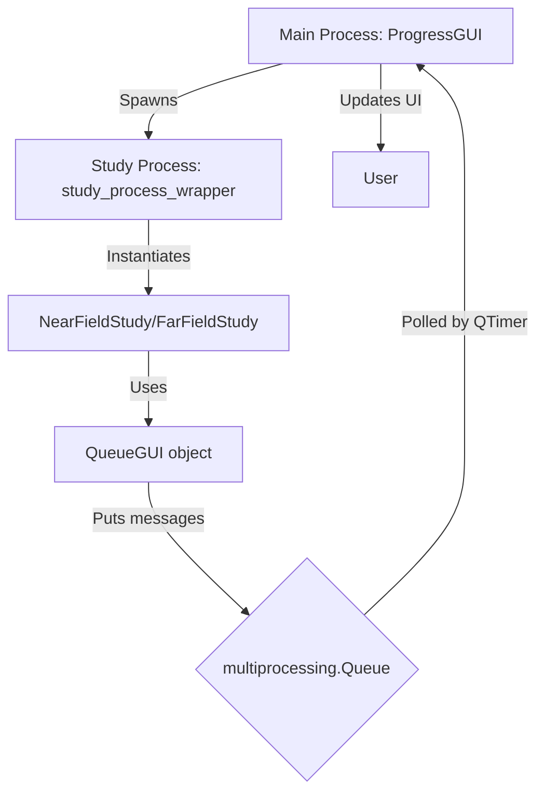

# Codebase Features: A Comprehensive Deep-Dive

This document details the architecture and workflow of the key operational features of the codebase, focusing on the graphical user interface (GUI), logging, session management, and the profiling/timing system.

## 1. High-Level Workflow

The application is designed to run scientific studies (e.g., Near-Field, Far-Field) which can be time-consuming. To provide user feedback and manage complexity, the system employs a multi-process architecture.

1.  **Main Process**: A lightweight PySide6 GUI (`ProgressGUI`) is launched. This GUI is responsible for displaying progress, logs, and timing information.
2.  **Study Process**: The actual study (`NearFieldStudy` or `FarFieldStudy`) is executed in a separate process using Python's `multiprocessing` module. This prevents the GUI from freezing during intensive calculations.
3.  **Communication**: The study process communicates with the GUI process through a `multiprocessing.Queue`. It sends messages containing status updates, progress information, and timing data.

The entry point for the study process is the `study_process_wrapper` function, which sets up a special `QueueGUI` object. This object mimics the real GUI's interface but directs all its output to the shared queue.

```python
# from src/gui_manager.py
def study_process_wrapper(queue, study_type, config_filename, verbose, session_timestamp, execution_control):
    """
    This function runs in a separate process and executes the study.
    It communicates with the main GUI process via a queue.
    """
    # ... setup ...
    class QueueGUI:
        def __init__(self, queue):
            self.queue = queue
            self.profiler = None

        def log(self, message, level='verbose'):
            if level == 'progress':
                self.queue.put({'type': 'status', 'message': message})
        
        def update_overall_progress(self, current_step, total_steps):
            self.queue.put({'type': 'overall_progress', 'current': current_step, 'total': total_steps})
        # ... other methods ...

    if study_type == 'near_field':
        study = NearFieldStudy(config_filename=config_filename, verbose=verbose, gui=QueueGUI(queue))
    # ...
    study.run()
    queue.put({'type': 'finished'})
```



## 2. GUI (`gui_manager.py`)

The GUI provides a real-time view of the study's progress. It runs in the main process and is designed to be responsive, even while the heavy computation happens elsewhere.

### Message Processing

The `ProgressGUI` uses a `QTimer` that fires every 100ms, calling the `process_queue` method. This method drains the queue of any pending messages from the study process and updates the UI accordingly.

```python
# from src/gui_manager.py
class ProgressGUI(QWidget):
    # ...
    def process_queue(self):
        while not self.queue.empty():
            try:
                msg = self.queue.get_nowait()
                msg_type = msg.get('type')

                if msg_type == 'status':
                    self.update_status(msg['message'])
                elif msg_type == 'overall_progress':
                    self.update_overall_progress(msg['current'], msg['total'])
                elif msg_type == 'stage_progress':
                    self.update_stage_progress(msg['name'], msg['current'], msg['total'])
                elif msg_type == 'start_animation':
                    self.start_stage_animation(msg['estimate'], msg['end_value'])
                # ... other message types ...
            except Empty:
                break
```

### The Animation System: A Closer Look

A key feature for user experience is the smooth animation of the stage progress bar. This is used for tasks where the simulation software doesn't provide real-time progress feedback, but we have a historical estimate of how long it should take.

**How it works:**

1.  **Initiation**: The study process, before starting a long-running subtask (like `run_simulation_total`), gets an estimated duration from the `Profiler`. It then sends a `start_animation` message to the GUI, containing this estimated duration.
    ```python
    # from src/studies/far_field_study.py (conceptual)
    def run_simulations(self):
        # ...
        if self.gui:
            # Tell the GUI to start an animation for the next step
            self.gui.start_stage_animation("run_simulation_total", i + 1)
        self.simulation_runner.run(sim)
    ```
    The `QueueGUI` object in the study process gets the estimate from its profiler instance and puts the message on the queue.
    ```python
    # from src/gui_manager.py
    class QueueGUI:
        # ...
        def start_stage_animation(self, task_name, end_value):
            estimate = self.profiler.get_subtask_estimate(task_name)
            self.queue.put({'type': 'start_animation', 'estimate': estimate, 'end_value': end_value})
    ```

2.  **Animation Setup**: When the `ProgressGUI` receives the `start_animation` message, it sets up the animation parameters. It records the `start_time`, the `duration` (from the profiler's estimate), the progress bar's `start_value`, and the `end_value` it needs to reach.
    ```python
    # from src/gui_manager.py
    def start_stage_animation(self, estimated_duration, end_step):
        self.animation_start_time = time.time()
        self.animation_duration = estimated_duration
        self.animation_start_value = self.stage_progress_bar.value()
        # ... calculate animation_end_value based on end_step ...
        
        self.animation_active = True
        if not self.animation_timer.isActive():
            self.animation_timer.start(50) # Start the animation timer (50ms interval)
    ```

3.  **Frame-by-Frame Update**: A dedicated `QTimer` (`animation_timer`) calls the `update_animation` method every 50ms. This method calculates how much time has passed since the animation started, determines the corresponding progress percentage, and updates the progress bar's value. This creates the smooth visual effect.
    ```python
    # from src/gui_manager.py
    def update_animation(self):
        if not self.animation_active:
            return

        elapsed = time.time() - self.animation_start_time
        
        if self.animation_duration > 0:
            progress_ratio = min(elapsed / self.animation_duration, 1.0)
        else:
            progress_ratio = 1.0

        value_range = self.animation_end_value - self.animation_start_value
        current_value = self.animation_start_value + int(value_range * progress_ratio)
        
        self.stage_progress_bar.setValue(current_value)
    ```

4.  **Termination**: Once the actual task is complete in the study process, it sends an `end_animation` message. This stops the animation timer and sets the progress bar to its final, accurate value, correcting for any deviation between the estimate and the actual time taken.

## 3. Logging (`logging_manager.py`)

The system uses Python's standard `logging` module, configured to provide two distinct streams of information.

### Loggers:

1.  **`progress` logger**: For high-level, user-facing messages. These are shown in the GUI and saved to `*.progress.log`.
2.  **`verbose` logger**: For detailed, internal messages. These are saved to the main `*.log` file.

### Implementation Details:

*   **Log Rotation**: The `setup_loggers` function checks the number of log files in the `logs` directory. If it exceeds a limit (10 pairs), it deletes the oldest pair (`.log` and `.progress.log`) to prevent the directory from growing indefinitely.
*   **Handler Configuration**: The function creates file handlers and stream (console) handlers for each logger, ensuring messages go to the right places. `propagate = False` is used to prevent messages from being handled by parent loggers, avoiding duplicate output.

```python
# from src/logging_manager.py
def setup_loggers(session_timestamp=None):
    # ... log rotation logic ...

    progress_logger = logging.getLogger('progress')
    progress_logger.setLevel(logging.INFO)
    # Remove existing handlers to prevent duplicates
    for handler in progress_logger.handlers[:]:
        progress_logger.removeHandler(handler)
    
    # File handler for progress file
    progress_file_handler = logging.FileHandler(progress_log_filename, mode='a')
    progress_logger.addHandler(progress_file_handler)
    
    # Stream handler for progress (console output)
    progress_stream_handler = logging.StreamHandler()
    progress_logger.addHandler(progress_stream_handler)
    progress_logger.propagate = False

    # ... similar setup for verbose_logger ...
    return progress_logger, verbose_logger, session_timestamp
```

## 4. Profiling and Timing (`utils.py`, `profiling_config.json`)

The `Profiler` class is the engine for the timing and progress estimation system.

### Key Concepts:

*   **Phases and Weights**: A study is divided into phases (`setup`, `run`, `extract`). `profiling_config.json` assigns a "weight" to each, representing its contribution to the total time.
    ```json
    // from configs/profiling_config.json
    {
        "phase_weights": {
            "setup": 0.299,
            "run": 0.596,
            "extract": 0.105
        },
        "subtask_estimates": {
            "setup_simulation": 48.16,
            "run_simulation_total": 107.54,
            "extract_sar_statistics": 4.09
        }
    }
    ```
*   **Dynamic Weights**: The profiler normalizes these weights based on which phases are active (controlled by `execution_control` in the config). If a user chooses to only run the `extract` phase, its weight becomes 1.0, and the progress for that phase represents 100% of the total work.
*   **Weighted Progress**: The `get_weighted_progress` method provides a more accurate overall progress.
    ```python
    # from src/utils.py
    def get_weighted_progress(self, phase_name, phase_progress):
        """Calculates the overall progress based on phase weights."""
        total_progress = 0
        for phase, weight in self.phase_weights.items():
            if phase == phase_name:
                total_progress += weight * phase_progress # Add partial progress of current phase
            elif phase in self.completed_phases:
                total_progress += weight # Add full weight of completed phases
        return total_progress * 100
    ```
*   **Time Estimation (ETA)**: The `get_time_remaining` method is adaptive. Initially, it relies on the `subtask_estimates`. Once one or more stages have completed, it switches to a more accurate method based on the actual average time taken per stage.
*   **Self-Improving Estimates**: After a run, `save_estimates` calculates the average time for each timed subtask and writes these new averages back to `profiling_config.json`. This makes future estimates more accurate.

## 5. Configuration (`config.py`)

The `Config` class uses a powerful inheritance mechanism to avoid duplicating settings.

*   **Inheritance**: A config can "extend" a base config. The `_load_config_with_inheritance` method recursively loads the base config and merges it with the child config. The child's values override the parent's.

    ```python
    # from src/config.py
    def _load_config_with_inheritance(self, path):
        config = self._load_json(path)
        
        if "extends" in config:
            base_config_path = self._resolve_config_path(config["extends"])
            base_config = self._load_config_with_inheritance(base_config_path)
            
            # Merge the base configuration into the current one
            config = deep_merge(base_config, config)
            
        return config
    ```
    For example, `near_field_config.json` might only specify the settings that differ from the main `base_config.json`.

## 6. Project Management

*   **`project_manager.py`**: This class is critical for reliability. The underlying `.smash` project files can become corrupted or locked. The `_is_valid_smash_file` method is a key defensive measure. It first attempts to rename the file to itself (a trick to check for file locks on Windows) and then uses `h5py` to ensure the file is a valid HDF5 container before attempting to open it in the simulation software. This prevents the application from crashing on a corrupted file.

This integrated system of GUI, logging, profiling, and configuration management provides a robust and user-friendly framework for running complex scientific simulations.