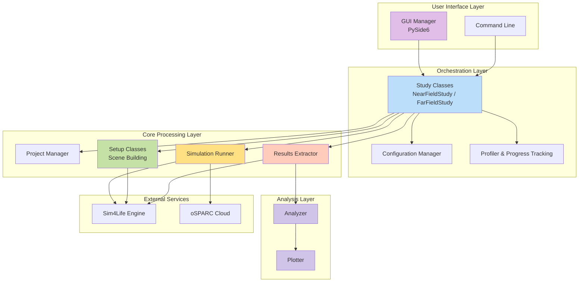
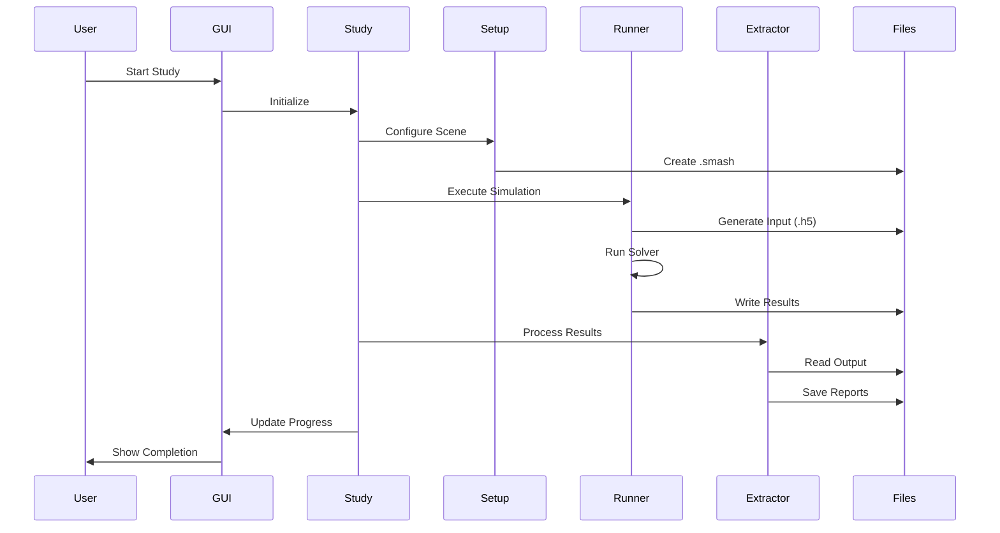

# GOLIAT Technical Guide

This document provides a comprehensive overview of the GOLIAT project's architecture, key components, and core functionalities. It is intended for developers who want to understand, extend, or maintain the codebase.

## Core philosophy

GOLIAT is designed with a modular, configuration-driven architecture. The primary goal is to automate the entire EMF dosimetry simulation workflow, from scene setup to results analysis, while ensuring reproducibility and scalability. The system is orchestrated by **Study** classes, which manage the simulation lifecycle based on parameters defined in JSON configuration files. This approach allows for easy modification of simulation parameters without changing the underlying code, and it ensures that simulations can be repeated with the exact same settings.

## System architecture

The application is structured in several distinct layers, each with a specific responsibility. This separation of concerns makes the system easier to understand, maintain, and extend.

## Workflow and component interactions

The simulation process follows a clear, sequential workflow, orchestrated by the `NearFieldStudy` or `FarFieldStudy` classes. This workflow ensures that each step is completed successfully before the next one begins, and it provides a clear structure for the entire simulation process.

## Core components

This section details GOLIAT's core classes and their roles within the framework. For a complete API reference, please see the [Full API Reference](api_reference.md).

### Orchestration layer

#### `Config`
- **Function**: Loads and manages hierarchical JSON configurations. A study-specific config (e.g., `near_field_config.json`) extends a `base_config.json`, allowing for a clean override system. This design minimizes duplication and makes it easy to manage different simulation scenarios. The `Config` class is responsible for loading the `base_config.json` and then recursively merging the study-specific configuration over it.
- **Noteworthy Methods**:
    - `get_setting(path, default)`: Retrieves nested settings using a dot-separated path.
    - `get_antenna_config()`: Returns antenna-specific settings.
    - `get_phantom_config(phantom_name)`: Returns settings for a specific phantom.
    - `_load_config_with_inheritance(path)`: The core method that handles the hierarchical loading of configuration files.
- **API Reference**: [src.config.Config](api_reference.md#src.config.Config)

#### `BaseStudy`, `NearFieldStudy`, `FarFieldStudy`
- **Function**: Orchestrates the entire simulation workflow. `BaseStudy` provides the core structure, including the main `run()` method, logging, and profiling. `NearFieldStudy` and `FarFieldStudy` inherit from `BaseStudy` and implement the `_run_study()` method, which contains the specific logic for each study type. This inheritance-based design allows for code reuse and a clear separation of concerns.
- **Noteworthy Methods**:
    - `run()`: The main entry point to execute the study. It handles top-level error handling and ensures that the necessary Sim4Life environment is running. It then calls the `_run_study` method.
    - `_run_study()`: This is the core of each study. It loops through phantoms, frequencies, and placements, coordinating the setup, run, and extraction phases for each simulation.
- **API Reference**:
    - [src.studies.base_study.BaseStudy](api_reference.md#src.studies.base_study.BaseStudy)
    - [src.studies.near_field_study.NearFieldStudy](api_reference.md#src.studies.near_field_study.NearFieldStudy)
    - [src.studies.far_field_study.FarFieldStudy](api_reference.md#src.studies.far_field_study.FarFieldStudy)

### Core processing layer

#### `ProjectManager`
- **Function**: Manages Sim4Life project files (`.smash`). It handles file creation, opening, saving, and validation to prevent issues with file locks or corruption. This is a critical component for ensuring the stability of the simulation process. It includes a `_is_valid_smash_file()` method that checks for file locks and verifies the HDF5 structure of the project file before attempting to open it.
- **Noteworthy Methods**:
    - `create_or_open_project(...)`: Creates a new project or opens an existing one based on the configuration.
- **API Reference**: [src.project_manager.ProjectManager](api_reference.md#src.project_manager.ProjectManager)

#### Setup Modules (`src/setups/`)
- **Function**: A collection of specialized classes, each responsible for a specific part of the scene setup in Sim4Life. All setup classes inherit from `BaseSetup`, which provides common functionalities like logging and access to the Sim4Life API. The `NearFieldSetup` and `FarFieldSetup` classes coordinate the execution of the other setup modules. This modular design makes it easy to add new setup steps or modify existing ones.
- **Primary Components**:
    - `PhantomSetup`: Loads and validates phantom models.
    - `PlacementSetup`: Positions the antenna relative to the phantom.
    - `MaterialSetup`: Assigns material properties to all entities.
    - `GriddingSetup`: Configures the spatial grid for the simulation.
    - `BoundarySetup`: Sets up the boundary conditions (e.g., PML).
    - `SourceSetup`: Configures the EMF sources and sensors.
- **API Reference**: [src.setups](api_reference.md#src.setups)

#### `SimulationRunner`
- **Function**: Executes the simulation, either locally using `iSolve.exe` or by submitting it to the oSPARC cloud platform. It also handles real-time logging of the solver output. A key feature is the `_run_isolve_manual` method, which runs the solver in a separate process and uses a non-blocking reader thread to capture and log its output in real-time.
- **Noteworthy Methods**:
    - `run_all()`: Iterates through and runs all simulations defined in the study.
- **API Reference**: [src.simulation_runner.SimulationRunner](api_reference.md#src.simulation_runner.SimulationRunner)

#### `ResultsExtractor`
- **Function**: Post-processes the simulation output. It uses a set of specialized extractor modules in the `src/extraction/` directory to pull key metrics. This modular approach makes it easy to add new extraction capabilities.
- **Extractor Modules**:
    - `PowerExtractor`: Extracts input power and power balance.
    - `SarExtractor`: Extracts detailed SAR statistics for all tissues.
    - `SensorExtractor`: Extracts data from point sensors.
    - `Reporter`: Generates detailed reports in Pickle and HTML formats.
    - `Cleaner`: Handles cleanup of simulation files to save disk space.
- **Noteworthy Methods**:
    - `extract()`: Orchestrates the entire extraction process.
- **API Reference**: [src.results_extractor.ResultsExtractor](api_reference.md#src.results_extractor.ResultsExtractor)

### Analysis layer

#### `Analyzer` & Strategies
- **Function**: The `Analyzer` class orchestrates the analysis of extracted results. It uses a strategy pattern, delegating the specifics of the analysis to a `BaseAnalysisStrategy` subclass (`NearFieldAnalysisStrategy` or `FarFieldAnalysisStrategy`). This design allows for different analysis workflows to be implemented without changing the core `Analyzer` logic. The strategy is responsible for loading the correct data, calculating summary statistics, and generating the appropriate plots.
- **Noteworthy Methods**:
    - `run_analysis()`: Loads results, applies the strategy, and generates reports and plots.
- **API Reference**:
    - [src.analysis.analyzer.Analyzer](api_reference.md#src.analysis.analyzer.Analyzer)
    - [src.analysis.base_strategy.BaseAnalysisStrategy](api_reference.md#src.analysis.base_strategy.BaseAnalysisStrategy)

#### `Plotter`
- **Function**: Generates a variety of plots from the analyzed data. It is designed to be a flexible component that can be easily extended to create new types of visualizations.
- **Noteworthy Methods**:
    - `plot_sar_heatmap(...)`: Creates a heatmap of SAR distribution by tissue.
    - `plot_average_sar_bar(...)`: Generates a bar chart of average SAR values.
    - `plot_pssar_line(...)`: Creates a line plot of peak spatial-average SAR.
    - `plot_sar_distribution_boxplots(...)`: Generates boxplots to show the distribution of SAR values.
- **API Reference**: [src.analysis.plotter.Plotter](api_reference.md#src.analysis.plotter.Plotter)

## Advanced features

*For a deep dive about the advanced features, refer to the [Advanced Features Guide](advanced_features.md)*

### Gui and multiprocessing
The application employs a multi-process architecture to ensure a responsive user experience, even during long-running simulations.

- **Main Process**: A lightweight PySide6 GUI (`ProgressGUI`) is launched. This GUI is responsible for displaying progress, logs, and timing information.
- **Study Process**: The actual study (`NearFieldStudy` or `FarFieldStudy`) is executed in a separate process using Python's `multiprocessing` module. This prevents the GUI from freezing during intensive calculations.
- **Communication**: The study process communicates with the GUI process through a `multiprocessing.Queue`. It sends messages containing status updates, progress information, and timing data.

The entry point for the study process is the `study_process_wrapper` function in `run_study.py`, which sets up a special `QueueGUI` object. This object mimics the real GUI's interface but directs all its output to the shared queue.

### Logging
The system uses Python's standard `logging` module, configured to provide two distinct streams of information:

- **`progress` logger**: For high-level, user-facing messages. These are shown in the GUI and saved to `*.progress.log`.
- **`verbose` logger**: For detailed, internal messages. These are saved to the main `*.log` file.

The `setup_loggers` function in `src/logging_manager.py` handles log rotation to prevent excessive disk usage.

### Profiling and timing
The `Profiler` class in `src/profiler.py` is the engine for the timing and progress estimation system.

- **Phases and Weights**: A study is divided into phases (`setup`, `run`, `extract`). `profiling_config.json` assigns a "weight" to each, representing its contribution to the total time.
- **Dynamic Weights**: The profiler normalizes these weights based on which phases are active.
- **Time Estimation (ETA)**: The `get_time_remaining` method is adaptive. Initially, it relies on historical estimates. Once one or more stages have completed, it switches to a more accurate method based on the actual average time taken per stage.
- **Self-Improving Estimates**: After a run, `save_estimates` calculates the average time for each timed subtask and writes these new averages back to `profiling_config.json`.

---
*For a complete and detailed API reference, please refer to the [Full API Reference](api_reference.md).*