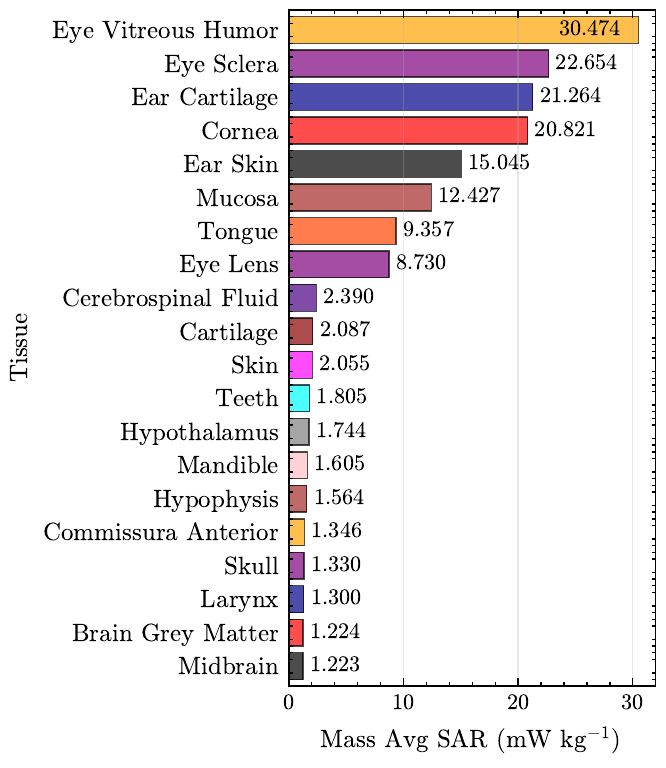

# Quick start: Your first GOLIAT simulation

Welcome to GOLIAT! This guide will get you up and running with your first automated EMF dosimetry simulation in minutes. GOLIAT streamlines the entire process using Sim4Life, handling scene setup, execution, and results analysis. We'll walk through a simple "Hello World" near-field simulation to calculate Specific Absorption Rate (SAR) and Surface Absorbed Power Density (SAPD) in a digital human phantom.

## What you'll achieve

By the end of this guide, you will have:

- Installed GOLIAT on your system
- Set up your Python environment with Sim4Life integration
- Created and configured a basic near-field simulation
- Run your first GOLIAT study
- Located and understood your simulation results

## Prerequisites

Before you begin, please ensure you have the following:

- **Sim4Life**: Version 8.2 or 9.2 with a valid license. Download from [ZMT Zurich](https://zmt.swiss/zurich-model-of-the-human-body/) if needed. Version 9.2 is recommended for new installations.
- **Python**: Version 3.11. GOLIAT uses the Python distribution bundled with Sim4Life, so you typically don't need a separate Python installation.
- **Digital Phantom Models**: GOLIAT automatically downloads phantom models (e.g., "thelonious" for a child, "eartha" for an adult) when you first run a simulation. You may be prompted to provide your email for licensing purposes.
- **Antenna Models**: Antenna models for various frequencies are downloaded automatically as needed.

**💡 Pro Tip**: If you're new to EMF dosimetry or Sim4Life, familiarize yourself with core concepts. See the [User Guide](user_guide.md) for background on SAR and digital human phantoms.

## Step 1: Install GOLIAT

GOLIAT supports two installation methods. Choose based on your needs:

**For users**: Install from PyPI and run from any directory. See [installation guide](../installation.md#pypi-installation) for details.

**For developers**: Clone the repository and install in editable mode. See [installation guide](../installation.md#editable-installation) for details.

### Quick PyPI install (users)

Most users (i.e., those that just want to get simulating ASAP) should create a virtual environment with Sim4Life Python:

```bash
C:\Program Files\Sim4Life_9.2.0.xxxxx\Python\python.exe -m venv venv --system-site-packages
source venv/Scripts/activate
python -m pip install goliat
```

The `--system-site-packages` flag allows the venv to access Sim4Life's packages (like `s4l_v1`). You can find your Sim4Life Python interpreter in your Sim4Life installation directory (e.g., `C:\Program Files\Sim4Life_9.2.0.xxxxx\Python\python.exe`).

**Note**: PyPI installation gives you the latest released version. For unreleased features or bug fixes, use editable installation.

Then navigate to your project directory and initialize:

```bash
cd /path/to/your/project
goliat init
```

This creates `configs/` and `data/` directories and downloads required models.

### Developer install (editable)

If you need to modify code or access repository tools:

```bash
# Clone repository
git clone https://github.com/rwydaegh/goliat.git
cd goliat

# Set up Sim4Life Python environment
source .bashrc

# Install in editable mode (or in a venv)
python -m pip install -e .

# Initialize GOLIAT
goliat init
```

**Note**: The `.bashrc` file adds Sim4Life Python to your PATH. GOLIAT will prompt you to copy it to your home directory for convenience.

## Step 2: Configure your first study

GOLIAT uses JSON configuration files to define your simulations. These files are located in the `configs/` directory that was created during initialization.

1.  **Choose a template**:
    -   For **Near-Field** simulations (device close to the body), copy `configs/near_field_config.json` to `configs/my_first_near_field_study.json`.
    -   For **Far-Field** simulations (whole-body plane wave exposure), copy `configs/far_field_config.json` to `configs/my_first_far_field_study.json`.

2.  **Edit your custom config** (e.g., `configs/my_first_near_field_study.json`):

        ```json
        {
          "extends": "base_config.json",
          "study_type": "near_field",
          "phantoms": ["thelonious"],
          "frequencies_mhz": [700],
          "execution_control": {
            "do_setup": true,
            "do_run": true,
            "do_extract": true
          }
        }
        ```
    
    **Note**: In this example, we use the "thelonious" child phantom and a single frequency (700 MHz) for a quick test run. GOLIAT's configuration system supports inheritance. Your custom config extends `base_config.json`, allowing you to override only the settings you need. For a deep dive into all available parameters, refer to the [Configuration Guide](../developer_guide/configuration.md).

3.  **Environment Variables (Optional)**: Create a `.env` file in the project root if needed:
    - **oSPARC Cloud Runs**: Add API credentials if using cloud execution
    - **Phantom Downloads**: Add email if prompted during phantom download

For details, see [Troubleshooting](../troubleshooting.md).

## Step 3: Run your first simulation

Now you're ready to launch your first GOLIAT study! Execute the following command in your terminal:

```bash
goliat study my_first_near_field_study
```

**What happens:**

- GOLIAT GUI opens showing real-time progress and ETA
- Downloads phantom and antenna models (one-time)
- Builds simulation scene in Sim4Life (loads phantom, places antenna)
- Runs FDTD solver via iSolve
- Extracts SAR metrics (whole-body, head/trunk, peak 10g SAR) and optionally SAPD
- Duration: 5-10 minutes depending on hardware


*GOLIAT GUI displaying real-time progress and simulation status.*

## Step 4: View and analyze results

Once the simulation is complete, GOLIAT will save all results in a structured directory within the `results/` folder. For our example, you'll find outputs in `results/near_field/thelonious/700MHz/by_cheek/`.

**Key output files**:
- `sar_results.json`: Contains normalized SAR values (e.g., mW/kg per 1W input power). May also include SAPD if extraction is enabled.
- `sar_stats_all_tissues.pkl`: A detailed Python pickle file with tissue-specific data.
- **Plots**: Various plots, such as SAR heatmaps and bar charts, visualizing the results.

You can also run the dedicated analysis script to aggregate and further process your results. Check out the [auto-generated first draft paper (only results)](https://github.com/rwydaegh/goliat/raw/master/paper/near_field/pure_results/results.pdf) to see an example of compiled analysis output:

```bash
goliat analyze --config my_first_near_field_study
```
This will generate additional CSV files and plots in the `results/` directory.

**Example results**:

<details>
<summary><b>View Analysis Results Gallery</b></summary>

SAR heatmap showing distribution across tissues and frequencies.


<details>
<summary>More plot types</summary>

Bar chart of average SAR by frequency.


Power balance overview.


Top 20 tissues by SAR.



</details>
</details>

**Troubleshooting**: Encountering issues? Refer to the [Troubleshooting Guide](../troubleshooting.md) for common problems and solutions (e.g., Sim4Life licensing, Python path errors, disk space management).

## Next steps

You've successfully run your first GOLIAT simulation. Here's what you can do next:

- **Explore all features**: Check out the [Full List of Features](../reference/full_features_list.md) to discover everything GOLIAT can do
- **Customize your studies**: Experiment with configuration files to explore different frequencies, phantoms, and antenna placements
- **Manage disk space**: For serial workflows, enable automatic cleanup: `"auto_cleanup_previous_results": ["output"]`. See [Configuration Guide](../developer_guide/configuration.md#execution-control)
- **Scale with the cloud**: Use oSPARC for parallel, large-scale simulations by setting `"batch_run": true` in your config

<details>
<summary><b>View Cloud Monitoring Dashboard</b></summary>

Web dashboard for monitoring distributed studies.


Track worker status and super studies.


</details>

- **Explore tutorials**: Start with [Far-Field Basics Tutorial](../tutorials/01_far_field_basics.ipynb) or [Parallel and Cloud Execution Tutorial](../tutorials/05_parallel_and_cloud_execution.ipynb)

If you have questions or encounter issues, open a [GitHub Issue](https://github.com/rwydaegh/goliat/issues).
---
